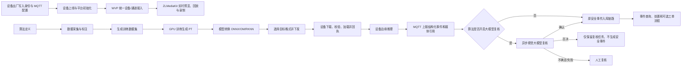

# VLStream Cloud 业务流程总览

> 文档目标：让开发人员和 Agent 在进入代码前，快速理解项目的业务边界、核心流程、状态变化与验证方式。
>
> 最近核对日期：2026-09-07

## 1. 阅读与维护规则

本文件是项目级业务上下文，不替代源码、数据库迁移、协议文档和运行时证据。出现不一致时，按以下优先级判断：

1. 当前运行环境的真实请求、日志、数据库和设备回执。
2. 当前分支源码、Flyway 迁移及自动化测试。
3. `docs/VLS-Protocol.md` 等协议和架构文档。
4. 本文件中的业务说明。

使用本文件时遵循以下约定：

- `[已实现]`：已从当前源码、接口或页面入口确认。
- `[依赖]`：流程依赖 WVP、ZLMediaKit、MQTT、对象存储、GPU 主机或设备固件等外部能力。
- `[环境约束]`：实现存在，但能否完成取决于部署配置、网络或设备能力。
- `[遗留]`：仍存在兼容入口，不应作为新功能的首选实现。
- `[待确认]`：能看到页面、数据结构或接口，但端到端业务闭环尚未得到充分运行时验证。

开发业务功能前必须阅读本文件。功能完成后必须在同一工作项中更新对应章节，至少记录：

- 用户从哪个页面、按钮或开放接口进入。
- 参与者是谁，各系统分别负责什么。
- 正常流程、核心状态及数据由谁持有。
- 外部依赖、失败分支、重试或人工处理方式。
- 本次验证到了哪一层：构建、接口、数据库、MQTT、设备回执或浏览器。
- 在末尾变更记录中增加一条简要记录。

纯重构或不改变业务行为的缺陷修复可以不改流程正文，但交付总结中必须说明已核对且业务流程未变化。本文不得记录访问令牌、密码、密钥、内网凭证或一次性签名地址。

## 2. 产品定位与系统边界

VLStream Cloud 面向视频设备接入、视频汇聚、算法生产、模型下发、边缘推理事件和业务处置。核心系统职责如下。

| 组件 | 核心职责 | 主要数据或结果 |
| --- | --- | --- |
| VLStream Web | 管理控制台、算法仓库、训练平台、决策 AI、监控告警、系统管理 | 用户操作和展示，不作为设备主数据源 |
| VLS Server | 多租户业务、设备绑定、算法/数据集/训练/模型、下发任务、事件与复核 | 业务表、任务状态、审计信息 |
| WVP Server | 统一且权威的视频设备中心 | 设备、通道、协议接入、预览、回放、PTZ、录制能力 |
| ZLMediaKit | 媒体流接收、代理和播放输出 | RTSP/RTMP/WebRTC/HLS 等媒体会话 |
| MQTT/EMQX | VLS 硬件双向消息通道 | 心跳、事件、控制、模型/固件任务及回执 |
| MinIO/S3 | 图片、数据集、模型、事件媒体等对象存储 | 对象键及短时签名上传/下载地址 |
| GPU 训练主机 | 训练和模型转换的计算执行环境 | Docker 任务、日志、PT/ONNX/OM/RKNN 产物 |
| MySQL/Redis | 持久化与缓存 | 租户业务数据、状态、缓存和任务协调信息 |

必须遵守的边界：

- 视频设备、通道及媒体能力以 WVP 为主数据源；VLS 不再建立第二套权威视频设备目录。
- VLS 保存自身业务关系，例如租户、用户绑定、训练任务、下发任务、事件与复核任务。
- MQTT 是设备控制和异步回执通道，HTTP 成功只表示平台已受理或已发布消息，不等于设备执行成功。
- 对象存储数据库字段应保存稳定对象键；浏览器预览、设备下载和上传使用有时效的签名地址。
- 所有业务查询和异步任务必须保持正确租户上下文，不能只依赖前端过滤。

## 3. 核心业务全景



## 4. 用户、租户与权限流程

### 4.1 登录和授权

1. 用户登录后获得会话凭据。
2. 前端路由和按钮根据菜单、角色及权限点控制显示。
3. 后端通过 Sa-Token、角色权限、数据权限和接口权限再次校验。
4. 业务服务按当前租户读取和写入数据。

验收不能只看按钮是否隐藏；必须验证越权接口被拒绝、跨租户数据不可见、后台任务不会串租户。

`[已实现]` VLS 自身签发的 Sa-Token 默认 `timeout=-1`，没有时间到期点；单租户密码登录、
平台换取的本地会话、兼容接口用户缓存和平台租户会话均使用永久 Redis 键。VLS Web 访问 WVP 时
继续传递同一 VLS Token，WVP 每次联邦请求仍向 VLS 校验身份，并把联邦 `LoginUser` 按永久键缓存。
“永不过期”不等于不可撤销：用户退出、主动注销、管理员踢出、账号停用或 Redis 数据被清理时，
对应会话仍会失效。外部 OortCloud/APaaS 平台原始 AccessToken 的有效期不由本配置改变。

可通过 `SA_TOKEN_TIMEOUT` 和 WVP 的 `WVP_TOKEN_EXPIRE_MINUTES` 覆盖默认值；负数表示永久，
正数仍分别按秒和分钟生效。

`[已实现]` 多租户模式要求 VLS 本地会话和它绑定的平台会话同时有效。页面刷新或首次进入受保护
路由时，VLS 先校验本地 Token，再由后端使用绑定的平台 Token 调用平台 `verifyToken`；浏览器缺少
平台 Token、平台 Token 已失效、租户或用户身份发生变化时，不能继续把永久 VLS Token 当作完整的
多租户登录，而是跳转统一平台重新授权，并以当前 VLS 页面作为回跳地址。页面运行期间平台接口
返回 `4004` 或等价的 AccessToken 失效信息时，也触发同一重授权流程；外部平台 Token 的实际寿命
仍由平台控制。

### 4.2 系统管理

`[已实现]` 系统管理包含用户、角色、菜单、部门、岗位、数据权限和 API 权限等基础能力。这些能力为设备、算法、事件、工单等业务提供访问控制，本身不改变核心视频或算法状态。

## 5. 设备生命周期

### 5.1 出厂、初始化和上线

1. 出厂或烧录阶段向设备写入唯一设备标识、设备密钥、MQTT 地址和必要协议参数。
2. 设备连接 MQTT，并通过约定主题上报心跳、状态和能力。
3. VLS 校验设备身份，记录在线状态、租户和用户业务关系。
4. 视频设备及通道通过 GB28181、ONVIF 或 RTSP 等方式进入 WVP。
5. WVP 与 ZLMediaKit 建立媒体链路，VLS Web 通过业务接口获得预览或播放地址。

`[依赖]` MQTT 可达、设备时钟和身份配置正确、WVP/ZLMediaKit 正常，是上线成功的前提。

### 5.2 统一设备目录

`[已实现]` 新业务应从 WVP 读取视频设备和通道。算法下发抽屉也调用 WVP 设备列表和分类接口，并使用 `protocolType=VLSTREAM` 筛选 VLS 设备。

关键标识规则：

- 前端提交 WVP 业务 `deviceId`，不是旧 VLS 本地设备表自增 ID。
- VLS 下发前通过 WVP 内部接口校验设备，并可在任务中保存 WVP 行 ID 作为关联信息。
- 新功能不得把同一个字段同时当作 WVP 业务标识和数据库主键。

### 5.3 配置、控制和状态

`[已实现]` 工作台“VLS 设备列表”、视频广场列表/设备树及视频回放列表/设备树，统一调用
WVP `/vlstream/device/list`，与“设备管理 → VLStream 协议”保持同一设备来源。工作台展示前
5 台，“更多”进入 `/vlstream/device`；视频广场和回放逐页读取完整目录，搜索支持设备名称和
业务设备 ID。离线或未上报视频流的设备仍在目录中，在线状态来自 WVP 的 `online` 字段。

`[已实现]` “设备管理 → VLStream 协议”列表将在线状态前移至设备名称前并固定在左侧，
用圆点和在线/离线文字展示，横向滚动时仍可见；当前页所有序列号均为空或纯空白时隐藏
序列号列，有任一有效值则显示。此调整只影响列表展示，设备状态来源、查询和控制流程不变。
本地浏览器已验证 5 台真实设备的空序列号列隐藏、状态首屏可见及横向滚动固定效果。

用户点击播放时，以 WVP 行 ID 查询该设备视频源并创建默认视频源预览；CameraRTC 使用
`CameraRtcPlayer`，其他视频源使用 WVP/ZLM 返回的 WebRTC 地址。加载中、没有视频源、取流失败
分别展示对应状态，关闭窗口释放播放器。设备主数据和媒体能力仍由 WVP 持有，不修改设备或绑定关系。

`[环境约束]` 视频回放页现有“播放”按钮是实时预览入口。VLS 设备尚未与旧本地录像目录建立
可靠关联，不能拿 WVP 行 ID 直接查询旧设备录像；缺少真实录像时间时显示“—”，历史录像入口
提示尚未关联。录像关联和历史回放接入不在此次列表切换范围内。

2026-09-07 验证：三个页面均展示相同的 5 台设备（1 在线、4 离线），广场和回放按设备 ID
搜索通过；三个实时预览入口均获得 1280×720 视频画面，工作台“更多”正确进入 VLS 设备页。
前端生产构建通过；205 台模拟目录覆盖分页、离线/无流保留、空列表和接口失败。
仓库缺少 ESLint 配置，常规检查无法运行，本次使用 `codex` 下临时配置完成改动文件的语法和模板检查。

1. 用户在设备详情或配置页提交业务操作。
2. VLS 校验租户、设备关系、参数与权限。
3. 需要设备执行的操作通过 MQTT 发布。
4. 平台先记录任务或指令状态。
5. 设备执行后通过 MQTT 回执，平台更新最终状态。

PTZ、预览、通道和媒体状态属于 WVP/ZLMediaKit 能力；VLS 专有 AI、模型、固件和设备业务配置主要通过 VLS Server 与 MQTT 完成。

#### 5.3.1 VLStream 设备状态详情（2026-09-08）

`[已实现]` “设备管理 → VLStream 协议”列表及详情展示格式化的最后心跳、最近上线时间和设备能力；
详情原固件区域改为设备上报模型表，点击“固件升级”打开原有兼容固件和 OTA 任务界面。
设备通过 `deviceBiz/state`（兼容旧 `device/state`）向 WVP 上报 `capabilities` 字符串数组及
`models` 对象数组，WVP 保存设备实际快照，VLS Web 读取 WVP 列表/详情接口，不以平台下发任务推断当前模型。

在线心跳中的新字段省略时保留已有快照，空数组明确清空；首次未上报显示“未上报”。
离线遗嘱保留能力和模型快照，不刷新最后在线心跳时间。最近上线时间采用 WVP 接收时间：
首次在线、离线转在线时记录，连续在线心跳不刷新；历史记录无上线时间时，从升级后首个合法在线心跳开始记录。
重复和过期状态沿用既有幂等/时序保护；非法快照类型返回 400，设备修正后可重传。
能力清单仅供展示，不授予设备控制权限，也不代替控制能力查询。原 OTA 兼容性、权限、在线状态和任务锁规则保持不变。

`[依赖]` 新字段依赖设备固件上报；当前实机尚未携带模型和能力信息，因此页面显示未上报。
新增字段由 WVP Flyway `V1_2_3__vlstream_device_state_snapshots.sql` 管理；既有历史时间不伪造回填。
验证：Java 8 下 4 项心跳服务测试、11 项前端展示断言及前端生产构建通过；本地 WVP 启动后接收实机心跳，
浏览器确认最近上线时间保持不变而最后心跳前进，详情模型空态和固件升级弹窗正常；协议 Word 已渲染检查。
实机非空能力和模型上报仍需硬件端按更新后的协议联调。

2026-09-09：`state` 心跳新增可选 `location` 对象，包含 WGS84 十进制度经纬度
`longitude`（-180～180）与 `latitude`（-90～90），仅在设备详情展示位置坐标，不接入地图。
设备上报、WVP 校验并保存经纬度，VLS Web 通过原详情接口读取。在线上报省略字段保留上次位置，
显式 `location:null` 清空；离线遗嘱、重复及过期消息不覆盖位置。坐标必须成对且为范围内数值，
非法值返回 400 并允许修正后重传；零坐标合法，平台四舍五入保留最多 8 位小数。
WVP Flyway `V1_2_4__vlstream_device_location.sql` 新增两个可空定点数字段，不回填虚构坐标。
验证：6 项心跳服务测试、10 项坐标展示断言、前端检查/构建通过；本地迁移成功，浏览器详情
显示位置坐标空态，协议 Word 保持原样式并完成渲染核对。当前实机未上报坐标，真实定位数据仍需设备端联调。

### 5.4 解绑和转移

2026-09-09 详情补充：仅 `availableUpgrades` 存在更高版本兼容固件时显示 RootFS 升级入口，
实际下发继续遵守后端 `canUpgrade`、权限和任务锁。视频源列读取设备上报的 `sourceUrl`；
WVP `/vlstream/device/{id}/streams` 在原设备列表权限保护下返回该字段，实体其他接口仍隐藏源地址。
源地址可能含认证参数，不写入日志。此接口变更需更新运行中的 WVP 后端才能显示地址。
现有 `heartbeatIndex` 虽约定重启归 1，但没有可靠心跳周期和启动首条记录，不能反推真实开机时间。

2026-09-09 设备详情调整：固件升级入口放在 RootFS 版本旁，模型区域标题为“设备运行模型”，
仍展示设备最近上报的模型快照及各模型状态，离线保留快照。
开机时间优先读取可选 `telemetry.bootTime`（Unix 毫秒）。2026-09-10 经用户确认，缺失或无效时
按 `lastReportedAt - (heartbeatIndex - 1) × 60 秒` 估算，以分钟展示时间；按用户要求去掉悬浮说明和“左右（估算）”后缀，计算口径不变。
60 秒来自当前设备实际心跳观察，不代表所有固件保证该周期；断网、周期变化及启动到首次心跳延迟
会造成偏差。缺少有效计数或时间仍显示“未上报”，不使用当前时钟持续推进估算开机时间。
WVP 已透传并保存 `telemetryJson`，无新增数据库字段；设备固件须上报真实启动时间才能显示。
在线时长按当前时间减本次 `lastOnlineTime`，弹窗打开时每秒刷新，关闭释放计时器；离线显示“离线”。
此时长基于详情读取到的在线状态，重新打开详情获取最新设备快照。OTA 权限和下发流程不变。

1. 用户发起解绑或转移。
2. VLS 校验当前租户、用户与设备关系。
3. 需要恢复或重置设备配置时，VLS 发送设备指令。
4. 收到设备回执后，再更新或移除绑定关系。

HTTP 接口返回受理成功不能代替设备回执。没有回执时应保留可诊断状态，不能伪造已解绑或已重置。

### 5.5 固件升级

1. 管理员维护固件及适配信息。
2. 选择设备并创建升级任务。
3. VLS 生成设备可访问的固件地址并通过 MQTT 下发。
4. 设备下载、校验、安装，持续回传进度和结果。
5. 平台按回执更新任务；取消操作也需要设备侧支持并确认。

`[环境约束]` 下载协议、TLS 证书、设备网络和固件实现决定实际结果。历史设备存在只支持 HTTP 下载的情况，新实现必须验证真实固件能力，不能为兼容而关闭 TLS 校验。

## 6. 视频汇聚、预览、回放与录制

### 6.1 实时预览

1. 用户从监控、设备或通道页面发起预览。
2. VLS Web 调用 WVP 的设备/通道/播放接口。
3. WVP 按 GB28181、ONVIF 或 RTSP 能力拉起媒体流。
4. ZLMediaKit 接收或代理流并输出浏览器可播放协议。
5. 页面播放并展示流状态；关闭预览时释放相应会话。

`[已实现]` VLS 侧仍有用于按需 RTSP/RTMP 转 WebRTC 的 `VlsZlmService` 等能力，但新的视频目录和通道业务仍应以 WVP 为准。

`[已实现]` VLStream 设备上报的 `/videocall/{deviceId}` CameraRTC 视频源由 WVP 识别为
`cameraRTC`，浏览器通过同源 `/bus/camera-rtc` WebSocket 代理与设备直接协商 WebRTC，
不经过 ZLMediaKit。页面上的 ZLM 健康状态不能代表 CameraRTC 媒体链路健康。

CameraRTC 客户端使用与原厂 `/videocall/{deviceId}` 页面一致的 `IE` 会话类型，创建 DataChannel，
并每 20 秒发送一次会话 `__ping`。播放对短暂 ICE `disconnected` 状态保留 8 秒恢复窗口；
窗口内恢复时继续原会话，持续中断、ICE 失败、设备呼叫超时或远端结束会话时，使用新的会话 ID
按指数退避持续自动重连，间隔最高 8 秒，不设置次数上限；只有关闭预览弹窗才会停止重连。

首次协商保持设备当次下发的原始 TURN 配置；重试时再按设备提供的 IP/域名 UDP、同端口 TCP
和域名 5349 TURN/TLS 逐项切换，避免部分设备固件因一次接收混合传输列表而超时。同一 TURN 服务的
其他地址可通过 `VITE_CAMERA_RTC_TURN_URLS` 配置。关闭预览后必须停止心跳和重连并释放信令、
DataChannel、PeerConnection 和媒体轨道。

2026-09-07 本地验证：原厂 `/videocall/{deviceId}` 页面与 VLStream 页面均通过 TURN Relay 建立
1280×720 视频；VLStream 页面首次会话无 `call time out`，连续播放 154 秒，期间按 20 秒周期完成
`__ping/_ping` 且未重建会话。连续重建三次独立预览均成功出画且未发生会话超时；关闭弹窗后
发送 `__disconnected` 并关闭信令 WebSocket。

### 6.2 回放和录制

`[已实现]` WVP 提供设备录像、云端录像、录制计划、媒体服务器等页面和接口。VLS 还提供 `VlsVideoRecordController`，支持回放、日历/日时间轴及按录像 ID 获取播放流。

回放成功需要同时验证：

- 录像索引或时间轴存在。
- 对应媒体文件或设备录像可访问。
- WVP/ZLMediaKit 已返回可播放流。
- 浏览器实际能够播放，而不只是接口返回 200。

### 6.3 遗留设备接口

`[遗留]` `VlsMqttDeviceController` 受 `vlstream.native-device.legacy-enabled=true` 控制，用于兼容旧的 VLS 本地设备入口。新功能除非明确处理兼容场景，不应把它作为统一视频设备中心。

## 7. 算法全生命周期

### 7.1 算法仓库和算法定义

1. 用户在“算法管理”按行业仓库和算法类型浏览算法。
2. 新增或编辑算法的基本信息、类别、说明和业务参数。
3. 算法成为标注、训练、模型、评估、复核和下发的共同业务主体。

`[已实现]` 算法库页面提供“算法库 / 算法分类”双视图。分类沿用算法仓库 ID，
通过 `parent_id` 构成租户隔离的层级树，因而已有算法、训练、模型和下发关系无需换号。
算法库可按选中分类及其全部下级和名称筛选，后端分页接口仍保留算法技术类型筛选参数。
分类管理允许新增同级或下级、
编辑、排序和设置树状/平铺展示；展示模式及平铺下级选择由后端按租户保存。
平铺设置支持从已有下级中选择，也支持直接输入名称创建新的下级分类并加入同级展示；
平铺模式隐藏左侧分类树，并在每个一级分类名称后横向排列其选定的直接下级。

删除分类前后端均以业务数据为准：系统预置分类、拥有下级的分类以及仍有关联算法的分类
均拒绝删除。停用分类会在算法库中连同其下级隐藏，但仍可在分类管理中恢复；分类维护不改变
算法的技术类型 `detect/segment/classify/pose/obb`。

`[已实现]` 核心入口为 `/algorithm-management`，后端以 `/vlsAlgorithm` 提供算法查询、维护、部署状态和评估等接口。

### 7.2 图片、标注和数据集

1. 创建算法标注任务，选择算法和标注类型。
2. 上传图片到对象存储，并在数据库保存稳定对象键和图片元数据。
3. 在标注页面维护类别和实例框/分割等标注信息。
4. 标注任务经历开始、进度更新、完成、重置和校验。
5. 调用 `POST /vlsAlgorithmAnnotation/{id}/save-dataset` 生成训练数据集。
6. 数据集供后续训练任务引用，也支持 ZIP 导入/导出和统计。

`[已实现]` 相关接口集中在 `/vlsAlgorithmAnnotation`、`/vlsAnnotationImage` 和标注实例接口。

算法标注 `/algorithm-standard` 的图片编辑页中，新画的矩形或圆形在选择标签后属于浏览器草稿，
选中后可用删除按钮或 Delete 键直接移除；点击“保存当前标注”或切换图片时写入后端。
2026-09-09：编辑器左右箭头、键盘及缩略图切换时，未标注图片直接切换，不调用空列表保存接口；
当前图片有标注时先保存，并同步后端实例 ID，
成功才切换；保存或同步失败留在当前图片，未选标签的图形阻止切换，保存中禁止重复切换及画图。
“全屏标注”将完整编辑区铺满浏览器可视区域，图片与标注等比放大，退出按钮或 Esc 恢复布局。
验证：切换成功、失败停留及未选标签保护通过模拟检查；真实保存接口及全屏视觉效果另行核验。

标签栏在网格和编辑页统一显示蓝色“添加标签”按钮。画框后的“选择标签”菜单也提供
“添加标签”，复用当前项目的标签创建接口；新增窗口关闭后返回标签菜单，保留待选标签的图形。
创建成功刷新标签列表，用户选中标签后才将图形加入当前图片草稿；创建失败保留新增窗口，
取消新增可继续选用已有标签。标签归属与标注保存边界保持不变。
2026-09-09 验证：生产构建通过，浏览器验证标签栏按钮可打开新增窗口；菜单草稿保留通过模拟检查。
标签菜单按浏览器可视区域避让底部和右侧边界，较长列表可滚动选择。
批量保存会重建实例 ID，前端保存成功后只同步该图片的实例，保留其他图片的草稿；
若保存成功但同步失败，页面提示重试，并阻止使用临时或过期 ID 删除。
已保存实例经确认后调用删除接口，删除实例保留原图片；无标注时原有删除图片确认流程保持不变。
验证：本地浏览器覆盖底部菜单、矩形/圆形草稿、选中非最后一个框和 Delete 键；
保存后 ID 同步、删除及同步失败保护通过模拟接口回归检查，未进行真实数据库保存/删除验证。

对象存储规则：后端读取训练图片时应依据对象键并走内部存储访问，不能依赖数据库中已经过期的浏览器签名 URL。

2026-09-08 标注进度修复：YOLO ZIP 导入按有有效标注的图片计数，每张图片只计一次；
标签使用量和导入结果的 `totalInstances` 仍按框数统计。修正迁移
`V1_2_0_012__repair_zip_annotation_image_progress.sql` 按当前有效、未剔除图片及其未删除实例
重新计算历史进度，不改图片、类别或实例。Java 8 下 5 项导入/手工标注回归通过，
当前安全帽项目由错误的 357/110 修正为 110/110，357 个框保留，迁移重复执行结果一致。
此次核对的导入和标注业务流程保持不变，仅修正统计口径。

### 7.2.1 数据集管理、数据来源与版本

2026-09-09 算法标注页目录导入交互：选择目录后仍立即按每批 15 张上传，
弹窗底部显示进度条及后端已确认导入数量/所选图片总数，取消原逐批顶部进度消息。
上传期间禁止重复选择、切换标注状态和关闭弹窗；完成或失败保留进度，失败时保留已成功批次。
图片存储、接口和标注归属流程不变，ZIP 导入沿用原流程。
验证：前端生产构建通过，模拟请求覆盖分批成功和部分失败；真实目录上传的浏览器进度待验收。

`[已实现]` 用户从“算法仓库 → 算法训练平台 → 数据集管理”进入 `/data-management`，
顶部切换“数据集 / 数据来源”。用户侧取消项目层级，原 `vls_algorithm_annotation` ID 和关联的
样本、类别、标注及版本保留，`/vlsData/projects` 仍作为兼容接口；新链接使用 `dataset` 参数。
顶部流程简化为“创建数据集 → 导入数据 → 数据标注 → 数据集与版本”，各阶段文字可打开对应操作。
未选择数据集的导入、标注、版本操作先选择目标数据集。新建数据集继续复用已有标注类型选择组件。

2026-09-09 界面收敛：按用户要求，前端隐藏质量筛选/检查、随机抽检、审核统计、低质量/剔除操作、
样本和版本详情的质量字段；版本比较不展示仅质量字段的变更。后台质量状态、接口、历史数据及划分规则保留。
导入方式仅展示已实现的本地、S3和公开文件链接；自有云盘、已有数据集、摄像头采集的TODO选项和提示不展示，
待办仅保留在开发文档。样本批量删除保留为独立按钮，继续使用确认弹窗和原逻辑删除接口。

实际能力核对后，数据集管理的新建标注类型只展示已有在线编辑/训练生成链路的物体检测。
历史分类/分割数据集保留查看、导入和版本管理，但不展示在线标注和训练目录生成入口，编辑时类型只读。
YOLO检测框ZIP选项仅向物体检测数据集展示；带标注导入不展示未支持的S3目录模式。
公开来源入口改称“公开文件链接”，表示实际文件下载导入，不代表整站数据集目录、搜索或任意格式解析。

2026-09-09 本轮导入主流程：

1. 新建或编辑数据集名称、唯一编号、说明、标注类型和规则；创建时间由服务端维护。
2. 导入页面选择“无标注信息 / 有标注信息”和渠道。本地支持图片、视频、文件夹和ZIP；
   有标注格式为VLS归档或YOLO检测框ZIP，不把其他格式当成已经支持。
3. 浏览器Worker分块计算完整SHA-256；VLS创建持久上传任务，固定当前默认OSS配置键和Bucket。
   浏览器按8 MiB发送分片，VLS校验片大小及摘要后写入MinIO multipart，数据库保存已确认片号和ETag。
   失败只重传缺失片；暂停、断网或刷新后重新选择同一原文件即可续传，未完成任务保留7天。
4. 完成分片校验和MinIO合并后进入后台队列。后台读取文件并校验完整大小/摘要，再流式解析和导入。
   状态区分 `UPLOADING/QUEUED/PROCESSING/COMPLETED/PARTIAL/FAILED/CANCELLED/EXPIRED`，
   上传100%不等于入库成功。导入记录在弹窗、数据集详情和数据来源页可查看；失败/部分成功可重试。
5. 数据来源管理支持外部S3 Endpoint、Region、Bucket、Prefix、只读凭据或匿名公开Bucket，
   支持分页列举、单对象/ZIP和Prefix目录导入；VLS仅读取外部对象，将内容复制到当前存储。
   已被排队/处理中任务引用的来源暂不允许修改配置或删除，避免执行途中改变目标。
6. 公开来源支持可直接下载的兼容图片、视频或ZIP。GitHub/Hugging Face/Gitee blob文件页可转换为
   下载地址；GitCode等可提供有效文件直链。后台校验每次DNS解析及重定向，拒绝内网/本机/元数据地址、
   非HTTP链接和HTTPS降级；不执行仓库脚本，不解析登录资源、Parquet/TAR等未适配格式。
7. ZIP支持ZIP64，先校验路径、容量、媒体和标注引用，文件存储完成后在数据库事务内一次登记。
   按内容摘要去重，重复文件不覆盖已有标注；失败回滚登记并清理本批对象。
   新流程导入检查格式/完整性，不新增数据清洗/增强；已有人工质量审核及历史质量记录继续保留。
8. 样本可按名称、标签、来源、标注状态、质量和划分检索，原标注页继续维护类别和实例。
   训练/验证划分仍支持比例随机、首类别分层和手动验证样本，两个集合非空且相同文件内容不跨集合。
9. 版本保存样本、稳定对象键、元数据、类别、标注、质量、划分和规则；重新划分/回退先备份当前版本。
   回退在事务内恢复并建立新记录；逻辑删除保留底层媒体，确保历史版本可恢复。
   生成训练目录仍冻结快照并写入全新版本目录，不覆盖已有训练引用；样本、标注或版本变化后需重新生成。

系统边界：VLS/MySQL持有来源配置、任务状态、样本和版本；当前MinIO持有上传分片及最终媒体；
外部S3/公开站点仅为读取来源。GPU不参与上传解析。新增接口沿用登录与可信租户校验；
跨租户后台扫描只用于领取任务，处理时恢复任务所属租户，并通过工作进程ID和心跳约束更新。
来源凭据在服务端加密保存，接口不回显，浏览器请求失败日志不打印带凭据的请求体。

`[边界]` 按用户确认的单文件（含ZIP）≤4 GiB（4,294,967,296字节）验收；更大文件尽力导入，
默认上限16 GiB。格式沿用JPG/JPEG、PNG、BMP、MP4、MOV、ZIP，图片仍有4000万像素限制。
ZIP默认解压总量32 GiB、30000文件/10000媒体，每数据集10000样本；空间不足和损坏文件明确失败。
视频校验容器结构，不等同逐帧解码；S3目录有标注导入需先打包为VLS或YOLO ZIP。
旧普通multipart/旧标注导入接口原有限额及旧ZIP导出1 GiB上限继续保留；新页面使用新的分片/后台导入入口。

`[TODO]` 自有云盘等待分享解析、目录列表、授权下载和刷新接口；平台已有数据集直接导入、摄像头采集
按用户要求保留TODO。百度网盘、平台官方公共数据集库、云服务数据回流不在范围内，无入口。
云盘同事需要提供的完整字段与测试样例见 `docs/dataset-import/COMPANY_DRIVE_INTEGRATION.md`。

`[验证]` 本轮在专用MySQL和当前本地MinIO的隔离测试Bucket执行迁移、上传、续传和入库验证。
精确4 GiB合成MP4容器经512片上传，在128片后恢复任务，最终对象/样本大小和SHA-256一致；
合成容器验证传输和结构边界，不是实际视频播放证明。浏览器256 MiB文件在17片后暂停并刷新，
重新选文件续传并入库。Hugging Face公开JPEG实测173131字节、640×480，页面可见来源和成功记录。
既有样本/版本回归、S3只读导入、凭据不回显、损坏分片、跨租户拒绝和VLS/YOLO归档测试通过；
前端构建和定向ESLint通过。新迁移尚未应用到用户当前业务库，业务后端需要更新重启后生效。
详细配置、限制和证据见 `docs/dataset-import/README.md` 与 `codex/dataset-import-v2/`。


#### 视频切图（2026-09-09）

`[已实现]` 数据集中的视频行和视频详情提供“视频切图”。用户选择开始时间、可选结束时间、
切图间隔和最多图片数，调用 `POST /vlsData/video-frames`，创建 `video-frames` 后台任务。
默认从0秒开始、每1秒一张、最多100张；范围为开始时间包含、结束时间不包含，结束超出时长时取到视频结尾。
每次最多1000帧，间隔0.1至3600秒，范围在24小时内；视频分辨率不超过4000万像素。

后台复用原始媒体存储，流式下载并校验视频，然后使用已打包的JavaCV/FFmpeg Windows/Linux x86_64解码。
按目标时间取实际视频帧并记录实际帧时间，输出JPEG；全部图片存储完成后，在同一数据库事务中
登记图片样本和 `vls_dataset_frame_origin` 来源关系，原视频保留。图片状态为未标注/未划分，
可通过原物体检测标注页标注，再划分训练集和验证集；视频本身仍不进入图片训练。

重复任务正在排队或处理中时复用任务；重复切出的相同内容按原SHA-256规则去重，保留多来源关系。
图片详情通过 `GET /vlsData/datasets/{datasetId}/samples/{sampleId}/video-origins` 展示来源视频和时间点。
原视频被删除/修改、不能解码、区间无画面、存储或容量失败时任务明确失败，清理未成功登记的暂存图片，
不删除原视频或既有样本；任务结果和处理进度沿用导入记录，可重试失败任务。
来源关系与样本ID关联并保留，逻辑删除和版本恢复不抹去已记录的来源。

迁移 `V1_2_0_014__dataset_video_frame_origins.sql` 增加来源表及任务进度说明。切图不执行GPU训练，
也不包含自动标注、跨帧目标跟踪或视频时序标签。功能和配置说明见 `docs/dataset-import/VIDEO_FRAMES.md`。
验证使用真正编码的测试视频：时间范围/数量、实际JPEG、重复切图、来源关系及跨数据集拒绝通过回归；
前端静态检查与构建通过。隔离环境浏览器实测2.5至4.5秒、每0.5秒切图，任务成功入库4张，
图片详情可预览并显示来源视频及4.000秒时间点；标注后训练/验证划分通过服务回归。
实际业务后端更新并执行新迁移后才能使用新增接口。

### 7.3 创建和执行训练

1. 用户在算法训练平台选择算法、数据集、基础权重和训练参数，创建训练任务。
2. 仅允许选择 `datasetPath` 非空的已生成数据集；未生成项目仍展示并禁用选择，可通过“去生成”返回算法标注页。
   一次训练选择一个数据集，提交前重新查询项目，防止标注变更后继续使用已失效路径。
   新建、编辑、恢复与启动训练的数据集 ID 按字符串传输，避免 19 位雪花 ID 被 JavaScript 数字舍入。
   调用 `POST /vlsAlgorithmTraining/{id}/start` 时，后端以数据库路径为准，通过配置的 SSH 主机检查
   `dataset.yaml` 为存在、可读且非空的普通文件；路径缺失、文件无效或连接失败均在入队前返回明确提示。
   校验通过后任务进入等待或执行状态。文件检查不替代数据质量检查，也不代表训练已经运行。
3. `GpuTrainingSchedulerService` 检查可用 GPU 与任务队列。
4. VLS 通过 SSH/SFTP 在配置的 GPU 主机准备数据、脚本和目录。
5. 训练在 Docker 容器内运行，平台轮询进程、日志和资源占用。
6. 成功后登记 PT 模型路径和训练指标；失败或停止时记录原因并释放资源。

`[已实现]` 当前主路径是 YOLOv8 目标检测。当前调度按 GPU 卡做独占占用；同一卡上的通用动态切分不是既有能力。远程服务器表记录不一定等于真实 SSH 目标，修改调度前必须核对最终配置解析链路。

`[环境约束]` GPU 主机、Docker 镜像、数据目录、磁盘空间、SSH 权限和训练脚本必须同时可用。构建通过不代表运行中的服务已经加载新代码，运行验证需要重启对应 JVM。

`[环境核对 2026-09-07]` 生产任务 `2096927699258966018` 已在 19:56 入队，但 GPU 上常驻
`llama-server` 占用约 5GB 显存，整卡独占调度继续等待；没有本任务训练容器或日志，不能称为“正在训练”。
GPU 利用率 0% 不等于无计算进程。状态轮询提示需同时等待前序任务完成及其他计算进程退出，前端展示
返回的等待原因，提交成功提示为“已入队”。本次未停止现有 GPU 服务、修改生产队列或启动新训练。

`[数据风险]` 同日生产“未系安全绳”项目虽显示 145/145，远端只有 130 个非空标签文件；旧生成目录
的 train/val 通过 SHA-256 核验全部 145 张图片重复。需要核对空标注并使用 7.2.1 的独立划分重新生成，
不能将旧目录的验证指标作为独立验证集效果。当前工作区生成逻辑已改变，生产仍运行旧后端。

`[本地验证]` Java 8 训练相关 20 项测试通过；隔离浏览器使用真实 Vue 组件与模拟接口验证禁用选择、
生成入口、过期路径阻断、新建/编辑/启动 ID 精度、排队提示，以及标注网格 40→60→80→100→120→140→145
张逐批渲染、筛选重置和手动加载。网格触底采用 2px 容差，并展示已显示数量；本轮修复尚未部署。

### 7.4 模型转换

1. PT 训练成功后，用户单独触发 `POST /vlsAlgorithmTraining/{id}/convert-model`。
2. 后端异步生成 ONNX，并依据目标硬件继续生成 OM、RKNN 或 INT8 RKNN 等产物。
3. 页面轮询各格式转换状态和错误信息。
4. 成功产物以真实文件路径或对象键登记，供下载和下发使用。

`[已实现]` 转换与训练是两个业务阶段，训练成功不等于设备格式已经可用。当前转换顺序按 ONNX → OM → RKNN 执行，以避免并行转换共享临时 ONNX 文件产生竞态。

Hi3519DV500 使用 OM 时，还必须满足目标芯片、CANN/ATC 版本、输入 shape、预处理、算子支持和设备侧 SVP ACL 运行时一致。RKNN 同样必须匹配设备 NPU 和运行时版本。

### 7.5 模型管理、发布与 Model Hub

算法库右上角 Model Hub 在新窗口打开模型市场；点击时优先读取当前平台令牌，
其次使用 OortCloud 登录保存的 Model Hub 令牌，通过 `accessToken` 查询参数传递。
无平台令牌时打开不带令牌的页面，不使用 VLStream 本地会话令牌兜底。

`[已实现]` `/vlsAlgorithmModel` 提供模型创建、按算法/训练查询、发布、取消发布、下载、部署、最新版本及热门模型等能力。

“发布到 Model Hub”是模型展示、共享和版本管理流程，不等同于“下发到摄像机”的模型选择依据。修改这两个流程时必须分别验证，不能因为某模型在 Model Hub 中最新，就假定设备下发一定选择它。

### 7.6 下发到摄像机

页面入口：算法管理卡片右上角菜单 → “下发到摄像机”。

当前流程：

1. 前端打开设备选择抽屉，从 WVP 获取 `protocolType=VLSTREAM` 的设备。
2. 用户选择一个或多个 WVP 业务 `deviceId`，并选择目标模型格式。
3. 前端提交算法 ID、设备 ID 列表和 `modelType`。
4. VLS 用 WVP 内部接口逐个校验设备。
5. `ModelDispatchService` 查询该算法已完成的训练，按 `updateTime DESC, id DESC` 从新到旧检查候选记录。
6. 在候选训练中选择第一份“请求格式对应的真实产物存在”的模型。
7. 每台设备创建独立下发任务，生成短时签名下载地址并通过 MQTT 发布任务。
8. 设备下载、校验、加载模型，通过 MQTT 回执更新任务状态。

模型选择的准确含义是：**优先使用最新完成训练中可用的目标格式产物；如果最新一轮没有该格式，会回退到更早一轮有该格式产物的已完成训练。** 当前实现最多检查最近 20 条已完成训练。它不是简单选择“最新发布到 Model Hub 的模型”。

当前默认格式为 OM，但页面可选 OM、RKNN、INT8 RKNN、ONNX、PT。真实可选项应由设备型号和运行时能力约束；在该能力矩阵完整实现前，必须由用户选择正确格式，并在下发前验证对应产物存在。

下发验收至少包含四层：

1. 数据库下发任务已创建，算法、训练、格式、设备和租户正确。
2. MQTT 指令实际发布，设备收到的标识和签名地址正确。
3. 设备能够下载并校验模型文件。
4. 设备加载完成并返回成功回执；平台最终状态同步。

## 8. 设备事件与媒体上传

### 8.1 事件媒体

1. 设备调用 `POST /vlsDeviceMedia/public/upload-url` 申请短时预签名 PUT 地址。
2. 设备把图片或视频直接上传到 MinIO/S3。
3. 设备通过 MQTT 事件消息上报媒体 ID、对象引用和结构化结果。
4. VLS 校验设备、消息和媒体归属后持久化关联。
5. 页面查看时调用 `GET /vlsDeviceMedia/{mediaId}/view-url` 获取新的短时预览地址。

数据库保存的是稳定媒体记录和对象键，不应持久化已经签名的完整临时 URL。
生成预签名地址时，客户端 Region 必须与对象存储一致；MinIO 未显式配置 Region 时按
`us-east-1` 处理。Region 或其他签名参数修改后必须重新申请地址，旧签名地址不可复用。
公网设备使用的 HTTPS API 根地址必须在签名阶段直接参与计算，反向代理不得在签名生成后
改写协议、主机名、端口、bucket 或对象路径；上传 PUT 和页面预览 GET 使用同一个公网根地址规则。
2026-09-04 验证：Java 8 定向回归测试通过；虚拟机公网重新申请地址后，53,572 字节测试文件
以 `image/jpeg` PUT 返回 HTTP 200，MinIO 对象存在。该验证未模拟 MQTT 事件绑定，测试媒体仍为 `ISSUED`。

### 8.2 AI 结构化事件

`[已实现]` `DeviceEventMqttHandler` 消费 VLS 2.2 的 `faceEvent` 和 `struct` 消息。消息先经过 MQTT 路由、设备身份和负载校验，再进入业务处理。

- `faceEvent` 保持独立原有链路，不进入算法大模型复核。
- `struct` 是算法结构化事件；启用按算法复核时，消息必须携带可解析的字符串 `algorithmId`。
- 未携带有效 `algorithmId` 或该算法未启用复核时，继续原安全事件上报链路。

## 9. 大模型视觉复核

大模型复核是结构化事件进入安全事件库之前的可选质量门，不是训练或模型下发的一部分。

### 9.1 OortCloud 授权、内置模型与测试

用户入口：页面顶部 OortCloud → 登录 OortCloud；查看与测试入口：算法仓库 → 大模型管理。

`[已实现]` 多租户模式下，所有已登录并进入工作台的用户均可看到顶部 OortCloud 入口，
不再要求平台超级管理员身份；单租户模式保留原管理员显示条件。租户模式仍由后端
`/sso/v1/mode` 决定，`build:test` 仅选择前端环境配置。入口展示不改变平台账户认证、
租户授权归属或后端接口权限；账户查询失败仍由原弹层展示登录提示或错误状态。
本次已从测试环境真实请求确认 `multi` 及租户管理员被旧超级管理员条件隐藏的原因，
部署后的浏览器已确认入口显示；ESLint 因项目缺少配置未能执行。

`[已实现]` 多租户弹层复用当前平台 AccessToken 和租户上下文，使用当前环境的网关配置
校验平台身份，成功后直接显示账户、额度、订阅及 Credits 记录。平台回调凭据优先于缓存，
不使用旧的独立 Model Hub 凭据或 VLS 本地会话 Token。模式异步加载完成后自动校验；
请求返回时若账号或租户已经变化，丢弃旧结果。平台身份过期则回统一平台重新授权，
账户资源接口失败则保留已验证的身份并展示加载错误。多租户切换和退出统一使用右上角
平台账号菜单，查看账户不会自动读取完整 API Key 或改写租户的大模型授权。
单租户管理员继续使用独立 OortCloud 登录、退出和原有授权同步流程。

`[已实现]` 账户弹层的 Credits 记录按所选日期向 OortCloud `/api/log/self` 分页查询，
每页固定 5 条，以接口返回的总数展示页码及上一页/下一页。刷新、日期筛选和重新打开
弹层从第一页加载；切换账号清空记录及页码，过时请求结果不覆盖新查询。查询失败显示
加载错误并保留上次成功结果，可点击刷新重试；记录及计费数据仍由 OortCloud 持有。
本地浏览器已验证 123 条记录的首页、第二页、末页 3 条及刷新回首页。

`[已实现]` 顶部 OortCloud → 获取更多 Credits → “购买资源包”与“升级至企业版”并列。
点击购买资源包时，使用当前账户会话请求 `/api/user/topup/info`，读取
`resource_pack_redirect_url` 并整页跳转；空地址回退平台 NewAPI 网关下的
`/console/topup`，该控制台相对路径不进入 VLS 路由。仅同平台 Origin 的地址附带当前
平台凭据，其他站点使用自身登录会话。请求失败提示重试，账号变化则丢弃旧结果。
资源包选择、订单与付款由目标平台页面负责，VLS 不创建订单或持有付款数据。
本地浏览器已确认外边框移除、按钮并列，以及真实配置跳转到含 Credit Pack 加量包的
OortCodex 定价页；未创建订单或验证支付到账。

验证边界：测试环境现有平台凭据调用身份及账户接口均成功；本地真实弹层组件在模拟接口下
通过 14 项会话和浏览器检查，`build:test` 构建通过。会话衔接修复后的部署页面待更新前端后验收。

1. 用户点击“登录 OortCloud”，前端使用短期 `accesstoken` 向 OortCloud 校验账户，并通过专用换票接口建立 VLStream 本地会话；平台令牌不能作为 VLStream 业务接口的认证令牌。
2. 校验成功后，前端调用 NewAPI 令牌列表接口，按接口返回顺序自动选择第一个 `status=1` 的启用令牌，再通过令牌 Key 接口换取完整 API Key；没有启用令牌时授权失败并明确提示。
3. 前端把 OortCloud 用户标识、显示名称和本次换取的 API Key 一次性提交给 VLStream。后端按当前租户把 API Key 加密保存到内置提供商记录，不保存用户 `accesstoken`，前端也不把完整 Key 写入本地或会话存储。
4. 内置 OortCloud 默认请求地址固定为
   `https://workup.oortcloudsmart.com:2443/bus/apaas-newapi/v1/chat/completions`，默认模型固定为 `qwen3.6-flash`。该行由系统创建并保护，页面不能编辑或删除。
5. “大模型管理”同时保留外部 OpenAI 兼容中转站的新增、编辑、删除和测试。外部提供商的地址、模型、超时和 API Key 由租户维护，API Key 同样只以密文保存在 VLStream 数据库中。
6. 实际模型调用只发送 `Authorization: Bearer <API Key>` 和标准 OpenAI 兼容 JSON 请求体，不携带用户 `accesstoken` 或平台网关业务头。
7. 用户浏览器中的 `accesstoken` 两小时过期、退出页面或停止登录会话，不影响已保存密文 Key 的后台异步复核。再次登录会重新自动选择启用令牌并刷新内置提供商的密文 Key。
8. 用户可在“大模型管理”选择任一已启用且已配置 Key 的提供商，调用 `/vlsLlmReview/providers/{id}/test` 发起一次同步视觉请求；内置 OortCloud 还要求已完成授权。测试提示词允许直接问图：模型返回结构化复核 JSON 时展示判定和置信度，返回普通文本时展示“连通成功”和原始回复。该宽松规则只用于人工连通性测试，正式异步复核仍必须返回合法的 `decision`、`confidence`、`reason` JSON。

授权登记属于当前租户数据，不能跨租户复用。若租户未授权，页面不能新开启算法复核；若历史配置处于开启状态但授权记录缺失，事件降级走原安全事件链路，不会因增强能力不可用而丢失基础告警。

`[环境约束]` 令牌管理接口不可达、平台登录令牌失效、账户没有启用令牌或换取 Key 失败时，内置 OortCloud 无法完成授权；API Key 无效时中转站会返回认证失败。大图片、模型排队、网络延迟和中转站推理速度都可能导致超时。增大服务端超时只能延长等待，不会解决认证失败、模型不可达、请求格式错误或推理服务本身卡住的问题。

### 9.2 按算法开启复核

1. 租户在算法管理中为单个算法配置是否启用、视觉大模型、提示词、置信度阈值、重试次数和图片范围。可以显式选择已授权的内置 OortCloud，也可以选择已启用且已配置 Key 的外部提供商；系统不会在提供商不可用时静默切换到另一家。
2. 设备上报带 `algorithmId` 的 `struct` 事件。
3. 系统验证配置和媒体，创建持久化复核任务，并交给异步 Worker 处理。
4. Worker 读取事件图片，调用视觉模型并解析结构化判断。
5. 结果分支：
   - 确认：调用原 `ActiveSafetyEventReportService`，生成正式安全事件。
   - 否决：复核任务保留结果，但不生成安全事件。
   - 不确定、重试耗尽或调用失败：进入人工复核。
6. 人工人员在复核任务页做最终决定；确认后补走原安全事件入库链路。

复核任务与正式安全事件是两个不同的数据对象。不能把“复核任务处理成功”直接解释为“安全事件已生成”。

## 10. 事件管理、场景治理与工单

### 10.1 事件管理

`[已实现]` 决策 AI 提供事件管理、事件详情和事件上报入口。设备事件经过校验和可选复核后进入事件库，页面按租户、设备、算法、类型、时间和处置状态查询。

`VlsEventManagementController` 提供分页、详情、创建及 multipart 上报能力；设备 MQTT 安全事件由 `ActiveSafetyEventReportService` 进入原业务链路。

### 10.2 场景治理和智能分析

`[已实现]` 页面和接口包含场景治理、智能分析申请、结果、算法编排和算法任务：

1. 用户配置业务场景及关联算法。
2. 提交智能分析申请，可查看或取消请求。
3. 编排或任务记录描述算法如何参与分析。
4. 分析结果回到决策 AI 页面进行查看和后续处置。

`[待确认]` 不同场景下“申请 → 调度 → 容器实例 → 结果”的端到端状态闭环需要在修改前按实际场景再次核对，不能仅凭 CRUD 页面推断自动执行已完成。

### 10.3 安全事件与工单

`[已实现]` 前端存在安全事件、我的工单、待办、已办、可认领和工单详情等入口，后端包含 Flowable 工作流模块。

`[待确认]` 安全事件在何种配置下自动建单、流程定义如何选择、认领/转派/办结如何回写事件，目前应以对应流程定义和服务代码为准。开发相关功能时必须补充以下内容：触发规则、流程实例 ID、业务主键、状态映射、重复建单保护和终止/撤回规则。

## 11. AI 算力与容器调度

`[已实现]` 系统维护远程服务器、资源类型、资源规格、容器实例、算法任务等数据，并为训练或分析提供算力基础。

训练调度当前关键事实：

- VLS Scheduler 负责排队和 GPU 卡占用判断。
- 训练通过 SSH/SFTP 和远端 Docker 执行。
- 单张 GPU 当前按独占资源处理，任务完成、失败或停止后必须释放。
- 新增多卡并行、动态显存切分或容器编排前，需要同时修改资源模型、调度锁、状态恢复和失败清理。
- 新 GPU 数据目录优先使用空间充足的数据盘，不能默认写入接近满载的系统盘。

`[待确认]` 通用容器实例与智能分析请求之间的自动调度闭环，修改前需要结合服务实现和运行日志核对。

## 12. 常见失败分支与完成证据

| 流程 | 常见失败 | 不能当作完成 | 最终应验证 |
| --- | --- | --- | --- |
| 设备上线 | MQTT 不通、身份不匹配、租户错误 | 页面出现设备名称 | 心跳持续、状态正确、WVP 通道可用 |
| 视频预览 | 设备离线、WVP/ZLM 拉流失败、浏览器协议不支持 | 播放接口返回 200 | 浏览器实际出画面并能正常关闭 |
| 数据集生成 | 对象键错误、签名 URL 过期、标注不完整 | 标注任务显示完成 | 后端可读对象、数据集结构和类别正确 |
| GPU 训练 | SSH、镜像、磁盘、GPU 占用或脚本失败 | 创建任务成功 | 日志、进程、状态、指标和 PT 文件一致 |
| 模型转换 | 工具链、芯片版本、算子、输入 shape 不匹配 | PT 已生成 | 目标产物真实存在并通过目标运行时验证 |
| 模型下发 | 选错格式、签名过期、设备仅支持 HTTP、MQTT 无回执 | HTTP 返回“下发成功” | 任务、MQTT、下载、校验、加载和回执闭环 |
| 大模型测试 | 大图、模型排队、网络/代理/服务超时 | 单纯调大超时 | 模型端收到请求并在预算内返回可解析结果 |
| 事件复核 | 无 algorithmId、媒体不可读、响应非结构化 | Worker 执行结束 | 复核状态和安全事件是否生成符合分支规则 |
| 工单 | 未命中触发规则、重复建单、流程定义错误 | 工单页可打开 | 流程实例、业务状态、处理记录与事件回写一致 |

## 13. 主要页面与代码入口索引

| 业务 | 前端入口 | 后端核心入口 |
| --- | --- | --- |
| 算法管理 | `/algorithm-management` | `VlsAlgorithmController`、`ModelDispatchService` |
| 大模型管理 | `/llm-provider-management` | `VlsLlmReviewController`、`OpenAiVisionClient` |
| 大模型复核任务 | `/llm-review-tasks` | `LlmReviewTaskService`、`LlmReviewWorker` |
| 算法训练平台 | `/algorithm-training-platform`、`/algorithm-training` | `VlsAlgorithmTrainingController`、`GpuTrainingSchedulerService` |
| 标注和数据集 | 训练平台相关标注页面 | `VlsAlgorithmAnnotationController`、`VlsAnnotationImageController` |
| 数据和样本管理 | `/data-management` | `VlsDataManagementController`、`DataManagementService`、`DataTransferService`、`DataTrainingPublisher` |
| 模型管理 | `/algorithm-model` | `VlsAlgorithmModelController` |
| 设备下发 | 算法卡片“下发到摄像机” | `VlsDeviceInfoController`、`ModelDispatchService` |
| 事件管理 | `/event-management`、安全事件页面 | `DeviceEventMqttHandler`、`ActiveSafetyEventReportService` |
| 场景与分析 | `/scene-governance`、`/intelligent-analysis-request`、`/intelligent-analysis-result` | 场景治理及 `VlsAnalysisRequestController` |
| 视频监控/回放 | `/monitoring-alarm`、`/video-playback`、WVP 页面 | WVP API、`VlsVideoRecordController`、`VlsZlmService` |
| 设备媒体 | 事件详情和媒体预览 | `VlsDeviceMediaController`、`DeviceMediaUploadService` |
| 固件升级 | 设备固件页面 | MQTT 固件任务、回执处理服务 |
| 算力与容器 | `/container-instances`、`/ssh-connection` | 远程服务器、资源规格、容器实例和调度服务 |
| 工单 | 我的/待办/已办/可认领/详情 | `ruoyi-flowable` 与安全业务服务 |

更细的 AI 训练、模型转换、Hi3519DV500、设备下发和 GPU 环境事实，还需读取本地忽略文件 `codex/VLSTREAM_AI_TRAINING_CONTEXT.md`。

## 14. 新功能记录模板

2026-09-09 标注类型展示核对：算法标注的“新增标注”和数据和样本管理的“新建/编辑项目”
共用 `AnnotationTypePicker`，以四张示意图卡片、选中标记和联动说明展示图像分类、物体检测、
实例分割及语义分割。弹窗适配视口，卡片空间不足时自动换行。类型值、校验、保存接口和后续
业务流程保持不变；示意图仅解释任务区别，不作为新增算法能力的声明。本地浏览器已验证两个
入口的四张卡片完整显示及第四项选择，前端构建通过。
同日复核说明：实例分割强调每个目标独立的像素级掩膜，语义分割强调逐像素类别且不区分
同类个体。卡片已替换为 Ultralytics 官方文档的真实图像示例并提供来源链接，图片通过
官方 CDN 加载，需要外网可达；本地浏览器已确认四张图片加载成功。标注业务流程不变。

新增或改变业务功能时，在对应章节补充内容，并在必要时使用以下模板：

```markdown
### 功能名称

- 状态：已实现 / 环境约束 / 待确认 / 遗留
- 用户入口：页面、按钮或开放接口
- 参与者：用户、VLS、WVP、ZLM、MQTT、设备、对象存储等
- 前置条件：权限、租户、设备状态、配置和外部依赖
- 正常流程：按业务顺序描述
- 核心状态：状态值、转换条件、最终态和数据所有者
- 失败处理：校验、重试、取消、补偿、人工处理
- 接口与代码：控制器、服务、消息主题、迁移文件
- 验证证据：构建、测试、接口、数据库、日志、MQTT、设备、浏览器
- 未决事项：尚未验证或需要产品决定的内容
```

## 15. 变更记录

2026-09-07：补齐训练数据集就绪校验、远端文件检查、ID 字符串传输、排队提示及标注网格触底加载；
核对生产训练被常驻 GPU 推理服务阻塞，并发现旧数据集 train/val 完全重复。本轮仅本地修复与验证。

| 日期 | 内容 | 依据 |
| --- | --- | --- |
| 2026-09-09 | 数据集管理取消用户侧项目层级，新增数据来源页、4 GiB分片续传、后台导入、外部S3与公开链接；明确云盘/已有数据集/摄像头TODO及移除渠道 | V1_2_0_013迁移、当前MinIO隔离测试、浏览器续传与公开图片实测；详见docs/dataset-import |
| 2026-09-09 | OortCloud 弹层移除外边框，新增按平台配置跳转的购买资源包入口 | 用户提供的前端对接文档、浏览器真实跳转及前端构建 |
| 2026-09-09 | OortCloud Credits 记录改为每页 5 条并支持分页，刷新和日期筛选从首页查询 | `OortCloudPopover.vue`、本地浏览器真实记录翻页及末页检查；ESLint 缺少项目配置 |
| 2026-09-09 | state 心跳增加 WGS84 经纬度，补齐校验、存储和设备详情展示及协议文档 | WVP Flyway 1.2.4、心跳服务测试、前端断言/构建、本地迁移及浏览器验证 |
| 2026-09-08 | 多租户 OortCloud 弹层复用当前平台会话，账户请求统一凭据和租户；单租户保留独立登录，平台过期回统一授权 | `oortCloudSession.js`、`OortCloudPopover.vue`、平台真实身份/账户响应及本地 14 项浏览器检查；部署后会话显示待验收 |
| 2026-09-08 | 多租户 OortCloud 顶栏入口向所有已登录用户展示，单租户保持原管理员条件 | `layout/index.vue`、测试环境模式和平台用户真实响应、`build:test` 构建；部署后显示待验收 |
| 2026-09-08 | 修复 multi 模式下永久 VLS Token 掩盖平台 Token 缺失或过期的问题：路由启动时双会话校验，平台接口运行中失效时回统一平台重新授权 | `validatePlatformSession`、`platformSession.js`、后端 14 项测试、前端回归脚本及浏览器失败请求证据 |
| 2026-09-08 | VLStream 设备列表和详情补充上线时间、能力和设备模型快照；固件升级改为按钮打开；补充 state 心跳协议 | WVP 状态服务、Flyway 1.2.3、本地实机心跳和浏览器验证、协议 Word 排版核对 |
| 2026-09-08 | VLS 自身 Token 与 WVP 联邦身份缓存改为默认永不过期，同时保留退出、注销、踢出和账号停用的撤销能力 | `application.yml`、`TokenService`、永久 Redis 缓存回归测试、VLS Actuator 生效值及 WVP 联邦接口 200 验证 |
| 2026-09-07 | 补齐项目字段、图片/视频样本导入与检索、质量筛选、训练/验证划分、版本快照/对比/回退及真实文件 ZIP 往返；训练生成改为版本目录并消除 train/val 样本重复 | `V1_2_0_011__data_sample_management.sql`、数据管理服务与页面、Java/MySQL 回归及浏览器验证 |
| 2026-09-07 | 工作台、视频广场及视频回放统一使用 WVP VLS 设备目录，播放复用 VLS 取流方式，区分设备业务 ID 与 WVP 行 ID，移除伪造的最近录制时间 | `vlsDeviceCatalog.js`、`VlsDevicePlayer.vue` 及三个页面；验证结果见本次交付 |
| 2026-09-07 | 修复标注标签菜单越界和未保存实例删除，同步保存后的实例 ID；标注到数据集的主流程保持不变 | `AlgorithmStandard.vue`、浏览器交互验证、前端构建与模拟接口回归检查 |
| 2026-09-08 | CameraRTC 预览重连调整为弹窗打开期间持续重试，退避间隔最高 8 秒，关闭弹窗时停止 | `CameraRtcPlayer.vue`、`cameraRtcSession.js`、6 项状态机测试及浏览器持续播放验证 |
| 2026-09-07 | CameraRTC 实时预览对齐原厂 `IE` 会话、DataChannel 和心跳协议，增加 ICE 短暂断连恢复、自动重连及分级 TURN TCP/TLS 回退 | `CameraRtcPlayer.vue`、`cameraRtcSession.js`、原厂页面对照及浏览器 CameraRTC 实播验证 |
| 2026-09-04 | 大模型接入调整为内置 OortCloud 与外部提供商共存；OortCloud 登录后自动选择首个启用的 NewAPI 令牌，换取 Key 后由后端按租户加密保存，算法显式选择提供商且不静默切换；平台令牌不再兜底认证 VLS 接口，人工测试兼容普通文本回复而正式复核保持严格 JSON | `OortCloudPopover.vue`、`request.js`、`LlmSystemProviderService`、`LlmReviewManagementService`、`LlmReviewTaskService`、`OpenAiVisionClient` |
| 2026-09-04 | 算法仓库升级为兼容原 ID 的层级分类，新增分类管理、租户级树状/平铺设置及后端聚合筛选 | `AlgorithmCatalogService`、`AlgorithmCatalogController`、`AlgorithmCatalogView.vue`、`V1_2_0_010__algorithm_category_hierarchy.sql` |
| 2026-09-04 | 修复设备事件媒体预签名 URL：MinIO 未显式配置 Region 时使用 `us-east-1`，并让设备 HTTPS 公网根地址直接参与 PUT/GET 签名，禁止签名后代理改写地址 | `OssClient`、`DeviceMediaUploadService`、`V1_2_0_008__repair_device_media_oss_region.sql`、设备上传接口验证 |
| 2026-09-03 | 建立项目级业务流程总览，覆盖系统边界、设备、视频、算法、训练、转换、模型下发、事件媒体、大模型复核、决策 AI、工单和算力调度 | 当前源码、路由、控制器、服务、架构文档及本地 AI 训练上下文 |
