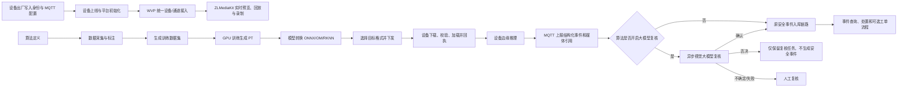

# VLStream Cloud 业务流程总览

> 文档目标：让开发人员和 Agent 在进入代码前，快速理解项目的业务边界、核心流程、状态变化与验证方式。
>
> 最近核对日期：2026-09-03

## 1. 阅读与维护规则

本文件是项目级业务上下文，不替代源码、数据库迁移、协议文档和运行时证据。出现不一致时，按以下优先级判断：

1. 当前运行环境的真实请求、日志、数据库和设备回执。
2. 当前分支源码、Flyway 迁移及自动化测试。
3. `VLStream-Cloud-Backend-Server/vls-stream/doc/VLS-Protocol.md` 等协议和架构文档。
4. 本文件中的业务说明。

使用本文件时遵循以下约定：

- `[已实现]`：已从当前源码、接口或页面入口确认。
- `[依赖]`：流程依赖 WVP、ZLMediaKit、MQTT、对象存储、GPU 主机或设备固件等外部能力。
- `[环境约束]`：实现存在，但能否完成取决于部署配置、网络或设备能力。
- `[遗留]`：仍存在兼容入口，不应作为新功能的首选实现。
- `[待确认]`：能看到页面、数据结构或接口，但端到端业务闭环尚未得到充分运行时验证。

开发业务功能前必须阅读本文件。功能完成后必须在同一工作项中更新对应章节，至少记录：

- 用户从哪个页面、按钮或开放接口进入。
- 参与者是谁，各系统分别负责什么。
- 正常流程、核心状态及数据由谁持有。
- 外部依赖、失败分支、重试或人工处理方式。
- 本次验证到了哪一层：构建、接口、数据库、MQTT、设备回执或浏览器。
- 在末尾变更记录中增加一条简要记录。

纯重构或不改变业务行为的缺陷修复可以不改流程正文，但交付总结中必须说明已核对且业务流程未变化。本文不得记录访问令牌、密码、密钥、内网凭证或一次性签名地址。

## 2. 产品定位与系统边界

VLStream Cloud 面向视频设备接入、视频汇聚、算法生产、模型下发、边缘推理事件和业务处置。核心系统职责如下。

| 组件 | 核心职责 | 主要数据或结果 |
| --- | --- | --- |
| VLStream Web | 管理控制台、算法仓库、训练平台、决策 AI、监控告警、系统管理 | 用户操作和展示，不作为设备主数据源 |
| VLS Server | 多租户业务、设备绑定、算法/数据集/训练/模型、下发任务、事件与复核 | 业务表、任务状态、审计信息 |
| WVP Server | 统一且权威的视频设备中心 | 设备、通道、协议接入、预览、回放、PTZ、录制能力 |
| ZLMediaKit | 媒体流接收、代理和播放输出 | RTSP/RTMP/WebRTC/HLS 等媒体会话 |
| MQTT/EMQX | VLS 硬件双向消息通道 | 心跳、事件、控制、模型/固件任务及回执 |
| MinIO/S3 | 图片、数据集、模型、事件媒体等对象存储 | 对象键及短时签名上传/下载地址 |
| GPU 训练主机 | 训练和模型转换的计算执行环境 | Docker 任务、日志、PT/ONNX/OM/RKNN 产物 |
| MySQL/Redis | 持久化与缓存 | 租户业务数据、状态、缓存和任务协调信息 |

必须遵守的边界：

- 视频设备、通道及媒体能力以 WVP 为主数据源；VLS 不再建立第二套权威视频设备目录。
- VLS 保存自身业务关系，例如租户、用户绑定、训练任务、下发任务、事件与复核任务。
- MQTT 是设备控制和异步回执通道，HTTP 成功只表示平台已受理或已发布消息，不等于设备执行成功。
- 对象存储数据库字段应保存稳定对象键；浏览器预览、设备下载和上传使用有时效的签名地址。
- 所有业务查询和异步任务必须保持正确租户上下文，不能只依赖前端过滤。

## 3. 核心业务全景



## 4. 用户、租户与权限流程

### 4.1 登录和授权

1. 用户登录后获得会话凭据。
2. 前端路由和按钮根据菜单、角色及权限点控制显示。
3. 后端通过 Sa-Token、角色权限、数据权限和接口权限再次校验。
4. 业务服务按当前租户读取和写入数据。

验收不能只看按钮是否隐藏；必须验证越权接口被拒绝、跨租户数据不可见、后台任务不会串租户。

### 4.2 系统管理

`[已实现]` 系统管理包含用户、角色、菜单、部门、岗位、数据权限和 API 权限等基础能力。这些能力为设备、算法、事件、工单等业务提供访问控制，本身不改变核心视频或算法状态。

## 5. 设备生命周期

### 5.1 出厂、初始化和上线

1. 出厂或烧录阶段向设备写入唯一设备标识、设备密钥、MQTT 地址和必要协议参数。
2. 设备连接 MQTT，并通过约定主题上报心跳、状态和能力。
3. VLS 校验设备身份，记录在线状态、租户和用户业务关系。
4. 视频设备及通道通过 GB28181、ONVIF 或 RTSP 等方式进入 WVP。
5. WVP 与 ZLMediaKit 建立媒体链路，VLS Web 通过业务接口获得预览或播放地址。

`[依赖]` MQTT 可达、设备时钟和身份配置正确、WVP/ZLMediaKit 正常，是上线成功的前提。

### 5.2 统一设备目录

`[已实现]` 新业务应从 WVP 读取视频设备和通道。算法下发抽屉也调用 WVP 设备列表和分类接口，并使用 `protocolType=VLSTREAM` 筛选 VLS 设备。

关键标识规则：

- 前端提交 WVP 业务 `deviceId`，不是旧 VLS 本地设备表自增 ID。
- VLS 下发前通过 WVP 内部接口校验设备，并可在任务中保存 WVP 行 ID 作为关联信息。
- 新功能不得把同一个字段同时当作 WVP 业务标识和数据库主键。

### 5.3 配置、控制和状态

1. 用户在设备详情或配置页提交业务操作。
2. VLS 校验租户、设备关系、参数与权限。
3. 需要设备执行的操作通过 MQTT 发布。
4. 平台先记录任务或指令状态。
5. 设备执行后通过 MQTT 回执，平台更新最终状态。

PTZ、预览、通道和媒体状态属于 WVP/ZLMediaKit 能力；VLS 专有 AI、模型、固件和设备业务配置主要通过 VLS Server 与 MQTT 完成。

### 5.4 解绑和转移

1. 用户发起解绑或转移。
2. VLS 校验当前租户、用户与设备关系。
3. 需要恢复或重置设备配置时，VLS 发送设备指令。
4. 收到设备回执后，再更新或移除绑定关系。

HTTP 接口返回受理成功不能代替设备回执。没有回执时应保留可诊断状态，不能伪造已解绑或已重置。

### 5.5 固件升级

1. 管理员维护固件及适配信息。
2. 选择设备并创建升级任务。
3. VLS 生成设备可访问的固件地址并通过 MQTT 下发。
4. 设备下载、校验、安装，持续回传进度和结果。
5. 平台按回执更新任务；取消操作也需要设备侧支持并确认。

`[环境约束]` 下载协议、TLS 证书、设备网络和固件实现决定实际结果。历史设备存在只支持 HTTP 下载的情况，新实现必须验证真实固件能力，不能为兼容而关闭 TLS 校验。

## 6. 视频汇聚、预览、回放与录制

### 6.1 实时预览

1. 用户从监控、设备或通道页面发起预览。
2. VLS Web 调用 WVP 的设备/通道/播放接口。
3. WVP 按 GB28181、ONVIF 或 RTSP 能力拉起媒体流。
4. ZLMediaKit 接收或代理流并输出浏览器可播放协议。
5. 页面播放并展示流状态；关闭预览时释放相应会话。

`[已实现]` VLS 侧仍有用于按需 RTSP/RTMP 转 WebRTC 的 `VlsZlmService` 等能力，但新的视频目录和通道业务仍应以 WVP 为准。

### 6.2 回放和录制

`[已实现]` WVP 提供设备录像、云端录像、录制计划、媒体服务器等页面和接口。VLS 还提供 `VlsVideoRecordController`，支持回放、日历/日时间轴及按录像 ID 获取播放流。

回放成功需要同时验证：

- 录像索引或时间轴存在。
- 对应媒体文件或设备录像可访问。
- WVP/ZLMediaKit 已返回可播放流。
- 浏览器实际能够播放，而不只是接口返回 200。

### 6.3 遗留设备接口

`[遗留]` `VlsMqttDeviceController` 受 `vlstream.native-device.legacy-enabled=true` 控制，用于兼容旧的 VLS 本地设备入口。新功能除非明确处理兼容场景，不应把它作为统一视频设备中心。

## 7. 算法全生命周期

### 7.1 算法仓库和算法定义

1. 用户在“算法管理”按行业仓库和算法类型浏览算法。
2. 新增或编辑算法的基本信息、类别、说明和业务参数。
3. 算法成为标注、训练、模型、评估、复核和下发的共同业务主体。

`[已实现]` 核心入口为 `/algorithm-management`，后端以 `/vlsAlgorithm` 提供算法查询、维护、部署状态和评估等接口。

### 7.2 图片、标注和数据集

1. 创建算法标注任务，选择算法和标注类型。
2. 上传图片到对象存储，并在数据库保存稳定对象键和图片元数据。
3. 在标注页面维护类别和实例框/分割等标注信息。
4. 标注任务经历开始、进度更新、完成、重置和校验。
5. 调用 `POST /vlsAlgorithmAnnotation/{id}/save-dataset` 生成训练数据集。
6. 数据集供后续训练任务引用，也支持 ZIP 导入/导出和统计。

`[已实现]` 相关接口集中在 `/vlsAlgorithmAnnotation`、`/vlsAnnotationImage` 和标注实例接口。

对象存储规则：后端读取训练图片时应依据对象键并走内部存储访问，不能依赖数据库中已经过期的浏览器签名 URL。

### 7.3 创建和执行训练

1. 用户在算法训练平台选择算法、数据集、基础权重和训练参数，创建训练任务。
2. 调用 `POST /vlsAlgorithmTraining/{id}/start` 后，任务进入等待或执行状态。
3. `GpuTrainingSchedulerService` 检查可用 GPU 与任务队列。
4. VLS 通过 SSH/SFTP 在配置的 GPU 主机准备数据、脚本和目录。
5. 训练在 Docker 容器内运行，平台轮询进程、日志和资源占用。
6. 成功后登记 PT 模型路径和训练指标；失败或停止时记录原因并释放资源。

`[已实现]` 当前主路径是 YOLOv8 目标检测。当前调度按 GPU 卡做独占占用；同一卡上的通用动态切分不是既有能力。远程服务器表记录不一定等于真实 SSH 目标，修改调度前必须核对最终配置解析链路。

`[环境约束]` GPU 主机、Docker 镜像、数据目录、磁盘空间、SSH 权限和训练脚本必须同时可用。构建通过不代表运行中的服务已经加载新代码，运行验证需要重启对应 JVM。

### 7.4 模型转换

1. PT 训练成功后，用户单独触发 `POST /vlsAlgorithmTraining/{id}/convert-model`。
2. 后端异步生成 ONNX，并依据目标硬件继续生成 OM、RKNN 或 INT8 RKNN 等产物。
3. 页面轮询各格式转换状态和错误信息。
4. 成功产物以真实文件路径或对象键登记，供下载和下发使用。

`[已实现]` 转换与训练是两个业务阶段，训练成功不等于设备格式已经可用。当前转换顺序按 ONNX → OM → RKNN 执行，以避免并行转换共享临时 ONNX 文件产生竞态。

Hi3519DV500 使用 OM 时，还必须满足目标芯片、CANN/ATC 版本、输入 shape、预处理、算子支持和设备侧 SVP ACL 运行时一致。RKNN 同样必须匹配设备 NPU 和运行时版本。

### 7.5 模型管理、发布与 Model Hub

`[已实现]` `/vlsAlgorithmModel` 提供模型创建、按算法/训练查询、发布、取消发布、下载、部署、最新版本及热门模型等能力。

“发布到 Model Hub”是模型展示、共享和版本管理流程，不等同于“下发到摄像机”的模型选择依据。修改这两个流程时必须分别验证，不能因为某模型在 Model Hub 中最新，就假定设备下发一定选择它。

### 7.6 下发到摄像机

页面入口：算法管理卡片右上角菜单 → “下发到摄像机”。

当前流程：

1. 前端打开设备选择抽屉，从 WVP 获取 `protocolType=VLSTREAM` 的设备。
2. 用户选择一个或多个 WVP 业务 `deviceId`，并选择目标模型格式。
3. 前端提交算法 ID、设备 ID 列表和 `modelType`。
4. VLS 用 WVP 内部接口逐个校验设备。
5. `ModelDispatchService` 查询该算法已完成的训练，按 `updateTime DESC, id DESC` 从新到旧检查候选记录。
6. 在候选训练中选择第一份“请求格式对应的真实产物存在”的模型。
7. 每台设备创建独立下发任务，生成短时签名下载地址并通过 MQTT 发布任务。
8. 设备下载、校验、加载模型，通过 MQTT 回执更新任务状态。

模型选择的准确含义是：**优先使用最新完成训练中可用的目标格式产物；如果最新一轮没有该格式，会回退到更早一轮有该格式产物的已完成训练。** 当前实现最多检查最近 20 条已完成训练。它不是简单选择“最新发布到 Model Hub 的模型”。

当前默认格式为 OM，但页面可选 OM、RKNN、INT8 RKNN、ONNX、PT。真实可选项应由设备型号和运行时能力约束；在该能力矩阵完整实现前，必须由用户选择正确格式，并在下发前验证对应产物存在。

下发验收至少包含四层：

1. 数据库下发任务已创建，算法、训练、格式、设备和租户正确。
2. MQTT 指令实际发布，设备收到的标识和签名地址正确。
3. 设备能够下载并校验模型文件。
4. 设备加载完成并返回成功回执；平台最终状态同步。

## 8. 设备事件与媒体上传

### 8.1 事件媒体

1. 设备调用 `POST /vlsDeviceMedia/public/upload-url` 申请短时预签名 PUT 地址。
2. 设备把图片或视频直接上传到 MinIO/S3。
3. 设备通过 MQTT 事件消息上报媒体 ID、对象引用和结构化结果。
4. VLS 校验设备、消息和媒体归属后持久化关联。
5. 页面查看时调用 `GET /vlsDeviceMedia/{mediaId}/view-url` 获取新的短时预览地址。

数据库保存的是稳定媒体记录和对象键，不应持久化已经签名的完整临时 URL。

### 8.2 AI 结构化事件

`[已实现]` `DeviceEventMqttHandler` 消费 VLS 2.2 的 `faceEvent` 和 `struct` 消息。消息先经过 MQTT 路由、设备身份和负载校验，再进入业务处理。

- `faceEvent` 保持独立原有链路，不进入算法大模型复核。
- `struct` 是算法结构化事件；启用按算法复核时，消息必须携带可解析的字符串 `algorithmId`。
- 未携带有效 `algorithmId` 或该算法未启用复核时，继续原安全事件上报链路。

## 9. 大模型视觉复核

大模型复核是结构化事件进入安全事件库之前的可选质量门，不是训练或模型下发的一部分。

### 9.1 提供商管理与测试

页面入口：算法仓库 → 大模型管理。

1. 管理员配置 OpenAI 兼容的视觉模型地址、模型名、加密 API Key、超时时间和启用状态。
2. 在“测试视觉模型”弹窗填写提示词并选择测试图片。
3. 页面调用 `/vlsLlmReview/providers/{id}/test`，后端发起一次同步视觉请求。
4. 只有模型在配置超时内返回且响应能被解析，测试才算成功。

`[环境约束]` 大图片、模型排队、网络延迟和提供商推理速度都可能导致超时。增大页面或服务超时只能延长等待，不会解决模型不可达、请求格式错误或推理服务本身卡住的问题。排查时应分别验证图片尺寸、请求体、后端超时、反向代理超时和模型端日志。

### 9.2 按算法开启复核

1. 在算法管理中为单个算法配置是否启用、提供商、提示词、置信度阈值、重试次数和图片范围。
2. 设备上报带 `algorithmId` 的 `struct` 事件。
3. 系统验证配置和媒体，创建持久化复核任务，并交给异步 Worker 处理。
4. Worker 读取事件图片，调用视觉模型并解析结构化判断。
5. 结果分支：
   - 确认：调用原 `ActiveSafetyEventReportService`，生成正式安全事件。
   - 否决：复核任务保留结果，但不生成安全事件。
   - 不确定、重试耗尽或调用失败：进入人工复核。
6. 人工人员在复核任务页做最终决定；确认后补走原安全事件入库链路。

复核任务与正式安全事件是两个不同的数据对象。不能把“复核任务处理成功”直接解释为“安全事件已生成”。

## 10. 事件管理、场景治理与工单

### 10.1 事件管理

`[已实现]` 决策 AI 提供事件管理、事件详情和事件上报入口。设备事件经过校验和可选复核后进入事件库，页面按租户、设备、算法、类型、时间和处置状态查询。

`VlsEventManagementController` 提供分页、详情、创建及 multipart 上报能力；设备 MQTT 安全事件由 `ActiveSafetyEventReportService` 进入原业务链路。

### 10.2 场景治理和智能分析

`[已实现]` 页面和接口包含场景治理、智能分析申请、结果、算法编排和算法任务：

1. 用户配置业务场景及关联算法。
2. 提交智能分析申请，可查看或取消请求。
3. 编排或任务记录描述算法如何参与分析。
4. 分析结果回到决策 AI 页面进行查看和后续处置。

`[待确认]` 不同场景下“申请 → 调度 → 容器实例 → 结果”的端到端状态闭环需要在修改前按实际场景再次核对，不能仅凭 CRUD 页面推断自动执行已完成。

### 10.3 安全事件与工单

`[已实现]` 前端存在安全事件、我的工单、待办、已办、可认领和工单详情等入口，后端包含 Flowable 工作流模块。

`[待确认]` 安全事件在何种配置下自动建单、流程定义如何选择、认领/转派/办结如何回写事件，目前应以对应流程定义和服务代码为准。开发相关功能时必须补充以下内容：触发规则、流程实例 ID、业务主键、状态映射、重复建单保护和终止/撤回规则。

## 11. AI 算力与容器调度

`[已实现]` 系统维护远程服务器、资源类型、资源规格、容器实例、算法任务等数据，并为训练或分析提供算力基础。

训练调度当前关键事实：

- VLS Scheduler 负责排队和 GPU 卡占用判断。
- 训练通过 SSH/SFTP 和远端 Docker 执行。
- 单张 GPU 当前按独占资源处理，任务完成、失败或停止后必须释放。
- 新增多卡并行、动态显存切分或容器编排前，需要同时修改资源模型、调度锁、状态恢复和失败清理。
- 新 GPU 数据目录优先使用空间充足的数据盘，不能默认写入接近满载的系统盘。

`[待确认]` 通用容器实例与智能分析请求之间的自动调度闭环，修改前需要结合服务实现和运行日志核对。

## 12. 常见失败分支与完成证据

| 流程 | 常见失败 | 不能当作完成 | 最终应验证 |
| --- | --- | --- | --- |
| 设备上线 | MQTT 不通、身份不匹配、租户错误 | 页面出现设备名称 | 心跳持续、状态正确、WVP 通道可用 |
| 视频预览 | 设备离线、WVP/ZLM 拉流失败、浏览器协议不支持 | 播放接口返回 200 | 浏览器实际出画面并能正常关闭 |
| 数据集生成 | 对象键错误、签名 URL 过期、标注不完整 | 标注任务显示完成 | 后端可读对象、数据集结构和类别正确 |
| GPU 训练 | SSH、镜像、磁盘、GPU 占用或脚本失败 | 创建任务成功 | 日志、进程、状态、指标和 PT 文件一致 |
| 模型转换 | 工具链、芯片版本、算子、输入 shape 不匹配 | PT 已生成 | 目标产物真实存在并通过目标运行时验证 |
| 模型下发 | 选错格式、签名过期、设备仅支持 HTTP、MQTT 无回执 | HTTP 返回“下发成功” | 任务、MQTT、下载、校验、加载和回执闭环 |
| 大模型测试 | 大图、模型排队、网络/代理/服务超时 | 单纯调大超时 | 模型端收到请求并在预算内返回可解析结果 |
| 事件复核 | 无 algorithmId、媒体不可读、响应非结构化 | Worker 执行结束 | 复核状态和安全事件是否生成符合分支规则 |
| 工单 | 未命中触发规则、重复建单、流程定义错误 | 工单页可打开 | 流程实例、业务状态、处理记录与事件回写一致 |

## 13. 主要页面与代码入口索引

| 业务 | 前端入口 | 后端核心入口 |
| --- | --- | --- |
| 算法管理 | `/algorithm-management` | `VlsAlgorithmController`、`ModelDispatchService` |
| 大模型管理 | `/llm-provider-management` | `VlsLlmReviewController`、`OpenAiVisionClient` |
| 大模型复核任务 | `/llm-review-tasks` | `LlmReviewTaskService`、`LlmReviewWorker` |
| 算法训练平台 | `/algorithm-training-platform`、`/algorithm-training` | `VlsAlgorithmTrainingController`、`GpuTrainingSchedulerService` |
| 标注和数据集 | 训练平台相关标注页面 | `VlsAlgorithmAnnotationController`、`VlsAnnotationImageController` |
| 模型管理 | `/algorithm-model` | `VlsAlgorithmModelController` |
| 设备下发 | 算法卡片“下发到摄像机” | `VlsDeviceInfoController`、`ModelDispatchService` |
| 事件管理 | `/event-management`、安全事件页面 | `DeviceEventMqttHandler`、`ActiveSafetyEventReportService` |
| 场景与分析 | `/scene-governance`、`/intelligent-analysis-request`、`/intelligent-analysis-result` | 场景治理及 `VlsAnalysisRequestController` |
| 视频监控/回放 | `/monitoring-alarm`、`/video-playback`、WVP 页面 | WVP API、`VlsVideoRecordController`、`VlsZlmService` |
| 设备媒体 | 事件详情和媒体预览 | `VlsDeviceMediaController`、`DeviceMediaUploadService` |
| 固件升级 | 设备固件页面 | MQTT 固件任务、回执处理服务 |
| 算力与容器 | `/container-instances`、`/ssh-connection` | 远程服务器、资源规格、容器实例和调度服务 |
| 工单 | 我的/待办/已办/可认领/详情 | `ruoyi-flowable` 与安全业务服务 |

更细的 AI 训练、模型转换、Hi3519DV500、设备下发和 GPU 环境事实，还需读取本地忽略文件 `codex/VLSTREAM_AI_TRAINING_CONTEXT.md`。

## 14. 新功能记录模板

新增或改变业务功能时，在对应章节补充内容，并在必要时使用以下模板：

```markdown
### 功能名称

- 状态：已实现 / 环境约束 / 待确认 / 遗留
- 用户入口：页面、按钮或开放接口
- 参与者：用户、VLS、WVP、ZLM、MQTT、设备、对象存储等
- 前置条件：权限、租户、设备状态、配置和外部依赖
- 正常流程：按业务顺序描述
- 核心状态：状态值、转换条件、最终态和数据所有者
- 失败处理：校验、重试、取消、补偿、人工处理
- 接口与代码：控制器、服务、消息主题、迁移文件
- 验证证据：构建、测试、接口、数据库、日志、MQTT、设备、浏览器
- 未决事项：尚未验证或需要产品决定的内容
```

## 15. 变更记录

| 日期 | 内容 | 依据 |
| --- | --- | --- |
| 2026-09-03 | 建立项目级业务流程总览，覆盖系统边界、设备、视频、算法、训练、转换、模型下发、事件媒体、大模型复核、决策 AI、工单和算力调度 | 当前源码、路由、控制器、服务、架构文档及本地 AI 训练上下文 |
