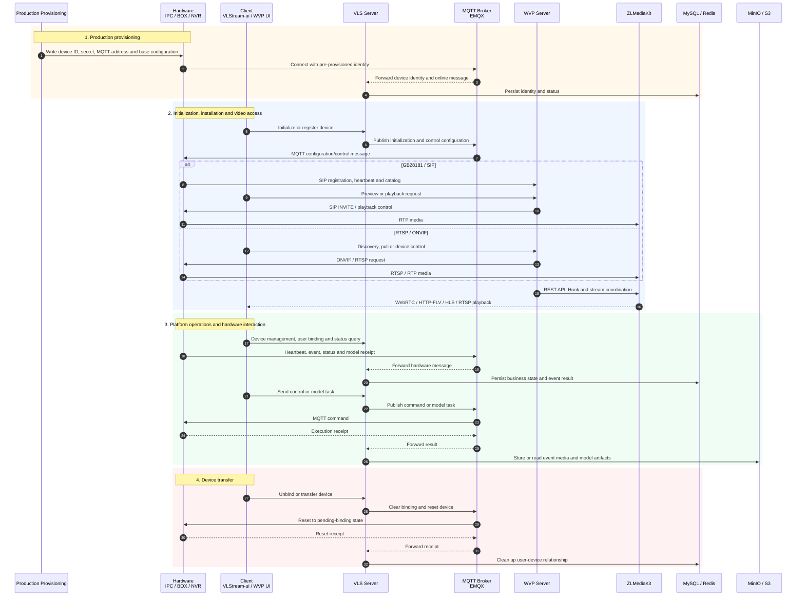

<div align="center">
  

  <h1>VLStream Cloud</h1>

  <p><strong>AI-Driven Open-Source Video IoT and Intelligent Stream Management Platform</strong></p>

  <p>
    <a href="./README.zh-CN.md">简体中文</a> |
    <strong>English</strong>
  </p>

  <p>
    <a href="https://github.com/OortCloudGroup/VLStream-Cloud/stargazers"></a>
    <a href="./LICENSE"></a>
    
    
    
  </p>

  <p>
    <a href="#-quick-start">Quick Start</a> •
    <a href="#-key-features">Key Features</a> •
    <a href="#-system-screenshots">System Screenshots</a> •
    <a href="#-application-scenarios">Application Scenarios</a> •
    <a href="#-architecture-and-project-structure">Architecture</a> •
    <a href="#-technology-stack">Technology Stack</a> •
    <a href="#-deployment">Deployment</a> •
    <a href="#-help-and-support">Help</a>
  </p>
</div>

---

> [!IMPORTANT]
> **Online environment:** [https://vlstream.oortcloudsmart.com:2443/bus/vls-ui/login](https://vlstream.oortcloudsmart.com:2443/bus/vls-ui/login)
> **Default account:** `admin` / `Codex@123456`
> This is the current online environment. Change the default password immediately after the first sign-in.

---

## 📖 Project Description

VLStream Cloud is an open-source Video IoT platform for device and stream
management, intelligent video analysis, algorithm lifecycle management,
monitoring, and alerting. It combines a Vue-based management console with a
Spring Boot multi-module backend and provides workflow, permission, scheduling,
object storage, and operational support for enterprise video applications.

> [!IMPORTANT]
> Connect only devices and video streams that you are authorized to access. Make
> sure your deployment and use of intelligent analysis comply with applicable
> privacy, security, and data-protection requirements.

---

## ✨ Key Features

| Feature | Description |
| --- | --- |
| Video Device Management | Device registration, grouping, tagging, health monitoring, connection tests, PTZ control, and stream discovery |
| Multi-Protocol Playback | Web video playback and low-latency streaming capabilities for common Video IoT scenarios |
| Intelligent Analysis | Analysis requests, real-time task monitoring, result management, and event governance |
| Algorithm Lifecycle | Algorithm warehouse, training tasks, annotations, model management, Hi3519DV500 OM conversion, and device deployment |
| Workflow Automation | Flowable-based process definition, deployment, tasks, and approval workflows |
| Enterprise Permissions | Sa-Token authentication, RBAC, data permissions, user management, and role management |
| Platform Services | Scheduled jobs, object storage, SMS integration, monitoring, and XXL-Job support |
| Visual Operations | Vue 3 management console with dashboards, GIS views, reusable CRUD components, and video layouts |

---

### Single-Node GPU Training Scheduler

Algorithm training supports an exclusive single-GPU queue on one physical GPU
server. A Docker container is created when a training job starts. Jobs wait
automatically while the GPU is busy, and the container is removed when training
finishes while job records, logs, and model artifacts are retained. See
[Single-Node GPU Training Scheduler](./VLStream-Cloud-Backend-Server/vls-stream/doc/gpu-training-scheduler.md).

---

### Hi3519DV500 Model Deployment

VLStream delivers trained models to devices through MQTT. Hardware connection,
model delivery, event reporting, media upload, status receipts, and integration
acceptance follow the
[VLS Platform and Camera Unified Communication Protocol](./VLStream-Cloud-Backend-Server/vls-stream/doc/VLS-Protocol.md).

Configure these environment variables:

```bash
VLSTREAM_MQTT_HOST=127.0.0.1
VLSTREAM_MQTT_PORT=1883
VLSTREAM_MQTT_USERNAME=vlstream
VLSTREAM_MQTT_PASSWORD=replace-me
VLSTREAM_MODEL_PUBLIC_BASE_URL=https://vlstream.example.com
VLSTREAM_MODEL_DOWNLOAD_SIGNING_SECRET=replace-with-a-long-random-secret
```

`VLSTREAM_MODEL_PUBLIC_BASE_URL` must be the backend address reachable by the
devices, not the browser-facing frontend address. Model download URLs use
short-lived HMAC signatures. Generate and inject a unique random signing secret
for each environment; never commit the real secret to Git.

---

## 🖥️ System Screenshots

<table>
  <tr>
    <td align="center" width="50%">
      <a href="./assets/screenshots/01-active-safety-events.png"></a><br>
      <strong>Active Safety Event Management</strong>
    </td>
    <td align="center" width="50%">
      <a href="./assets/screenshots/02-event-feedback-workflow.png"></a><br>
      <strong>Event Feedback &amp; Workflow</strong>
    </td>
  </tr>
  <tr>
    <td align="center" width="50%">
      <a href="./assets/screenshots/03-work-order-management.png"></a><br>
      <strong>Work Order Management</strong>
    </td>
    <td align="center" width="50%">
      <a href="./assets/screenshots/04-workflow-designer.png"></a><br>
      <strong>Visual Workflow Designer</strong>
    </td>
  </tr>
  <tr>
    <td align="center" width="50%">
      <a href="./assets/screenshots/05-algorithm-training-management.png"></a><br>
      <strong>Algorithm Training Management</strong>
    </td>
    <td align="center" width="50%">
      <a href="./assets/screenshots/06-algorithm-training-console.png"></a><br>
      <strong>Algorithm Training Console</strong>
    </td>
  </tr>
</table>

> Click any screenshot to view it at full resolution.

---

## 🌐 Application Scenarios

<table>
  <tr>
    <td align="center" width="33%">
      <br>
      <strong>Chemical Production Safety</strong>
    </td>
    <td align="center" width="33%">
      <br>
      <strong>Smart Water Conservancy</strong>
    </td>
    <td align="center" width="33%">
      <br>
      <strong>Wastewater Treatment</strong>
    </td>
  </tr>
  <tr>
    <td align="center" width="33%">
      <br>
      <strong>Smart Construction Site</strong>
    </td>
    <td align="center" width="33%">
      <br>
      <strong>Smart Community</strong>
    </td>
    <td align="center" width="33%">
      <br>
      <strong>Gas Station Safety</strong>
    </td>
  </tr>
  <tr>
    <td align="center" width="33%">
      <br>
      <strong>Smart Kitchen</strong>
    </td>
    <td align="center" width="33%">
      <br>
      <strong>Smart Campus</strong>
    </td>
    <td align="center" width="33%">
      <br>
      <strong>Smart City Management</strong>
    </td>
  </tr>
</table>

---

## 🧰 Technology Stack

### Backend

| Category | Technology |
| --- | --- |
| Runtime | Java 8 |
| Framework | Spring Boot 2.7.11, RuoYi-Flowable-Plus 0.8.3 |
| Persistence | MyBatis-Plus 3.5.3.1 |
| Authentication | Sa-Token 1.34.0 |
| Workflow | Flowable 6.8.0 |
| Cache and Locking | Redis, Redisson 3.20.1, Lock4j |
| API Documentation | Springdoc OpenAPI, Knife4j |
| Build | Maven 3.6+ |

### Frontend

| Category | Technology |
| --- | --- |
| Framework | Vue 3.3, Vue Router 4 |
| Build Tool | Vite 4.4 |
| UI | Element Plus 2.3, Avue 3.7 |
| State Management | Pinia 2.1 |
| Video | hls.js, xgplayer |
| GIS | Leaflet 1.9 |
| HTTP | Axios 1.4 |

---

## 🏗️ Architecture and Project Structure

VLStream Cloud's core business architecture is organized into three categories:

- **Hardware:** IPC, BOX, and NVR devices. The lifecycle covers production provisioning, installation and protocol access, platform operations, and device transfer.
- **Platform servers:** VLS owns AI events, model delivery, and platform business; WVP is the sole video-device center for VLStream and other protocols, device state, and video control; ZLMediaKit provides the media server behind WVP; MQTT, MySQL, Redis, and MinIO provide messaging, persistence, cache, and object storage.
- **Client:** VLStream-ui provides platform operations, while the WVP UI provides video preview, playback, PTZ, and channel management.

The complete lifecycle sequence diagram and dependency inventory are maintained in
[Core Business and Technical Architecture](./architecture/vlstream-core-business-technical-architecture.md).



### Runtime Server Dependencies

The following versions are taken from the current release Compose or project
configuration. A version marked **not pinned** must be fixed in the formal
deployment manifest before production release.

| Name | Purpose | Version | License |
| --- | --- | --- | --- |
| VLStream Server (VLS) | Device registration, user binding, events, model tasks, and platform APIs | Maven `1.2.1`; Spring Boot `2.7.11`; release image `1.2.1` | [MIT](./LICENSE) |
| WVP Server | Required unified video-device center for VLStream, GB28181/SIP, ONVIF, RTSP, preview, playback, PTZ, and video control | `3.8.9`; Spring Boot `2.7.18` | [MIT](https://gitee.com/xiaochemgzi/RuoYi-Wvp/blob/master/LICENSE) |
| ZLMediaKit | RTP ingest, media management, REST/Hook, and playback output | **Not pinned** in WVP/VLStream repositories | [MIT](https://docs.zlmediakit.com/zh/more/license.html) |
| MQTT Broker / EMQX | Device messaging, heartbeat, events, commands, and model receipts | `5.4`; external service in release Compose | [Apache-2.0](https://github.com/emqx/emqx-docker/blob/main/LICENSE) |
| MySQL | Business database | `8.4.10-oraclelinux9` | [GPLv2 or commercial license](https://dev.mysql.com/doc/refman/8.4/en/what-is-mysql.html) |
| Redis | Cache, sessions, online state, and runtime state | `7.4.9-alpine` | [RSALv2 or SSPLv1](https://redis.io/legal/licenses/) |
| MinIO / S3 | Event media, model files, and object storage | `RELEASE.2025-09-07T16-13-09Z` | [AGPLv3 or commercial license](https://min.io/compliance) |

Nginx or an equivalent gateway is normally required for frontend static files
and reverse proxying. WebRTC Streamer `v0.8.16` is optional for the VLS direct
RTSP-to-WebRTC path; FFmpeg is an optional WVP/ZLMediaKit pull and conversion
helper, not another standalone media platform.

### Repository layers

The backend paths in the following table are relative to
`VLStream-Cloud-Backend-Server/vls-stream/`.

| Layer | Main paths | Responsibility |
| --- | --- | --- |
| Operator client | `VLStream-Web/VLStream-ui/` | Dashboards, device and stream management, AI operations, workflow, and system administration |
| Device client | `sdk/` | Native camera-side RTSP/WebRTC streaming, AI inference, event reporting, and model updates |
| Application services | `ruoyi-admin/`, `ruoyi-vlstream/` | API entry point and VLStream domain services |
| Platform services | `ruoyi-common/`, `ruoyi-framework/`, `ruoyi-system/`, `ruoyi-flowable/`, `ruoyi-job/`, `ruoyi-oss/`, `ruoyi-sms/`, `ruoyi-extend/` | Shared infrastructure, authentication, permissions, workflows, jobs, storage, messaging, and monitoring |
| Operations and documentation | `deploy/`, `docs/`, backend `deploy/` and `script/` | Container deployment, database initialization, migration support, protocols, and operational documentation |

### Top-level layout

```text
VLStream-Cloud/
├── VLStream-Cloud-Backend-Server/
│   └── vls-stream/                  # Java 8 / Spring Boot Maven reactor
│       ├── ruoyi-admin/             # Executable application and REST APIs
│       ├── ruoyi-vlstream/          # Devices, streams, AI, events, and models
│       ├── ruoyi-system/            # Users, roles, permissions, and system services
│       ├── ruoyi-framework/         # Web, security, and framework configuration
│       ├── ruoyi-flowable/          # Workflow and approval services
│       ├── ruoyi-common/            # Shared models, utilities, and base components
│       ├── ruoyi-generator/         # Code generation
│       ├── ruoyi-job/               # Scheduled jobs
│       ├── ruoyi-oss/               # Object storage integration
│       ├── ruoyi-sms/               # SMS integration
│       ├── ruoyi-extend/            # Monitoring and XXL-Job services
│       ├── ruoyi-demo/              # Examples and integration tests
│       ├── deploy/                  # Backend deployment resources
│       └── script/                  # Database and Docker scripts
├── VLStream-Web/
│   └── VLStream-ui/                 # Vue 3 management console
├── sdk/                             # Hi3519DV500 native camera business SDK
├── deploy/                          # Repository-level deployment assets
├── docs/                            # Repository-level documentation
├── assets/                          # Screenshots and application imagery
├── tools/                           # Development and validation tools
├── LICENSE
├── README.md                        # English documentation (default)
└── README.zh-CN.md                  # Simplified Chinese documentation
```

### Device SDK (`sdk/`)

The `sdk/` directory is the camera-side native component, not a Maven or npm
module. It exports the business source used to build the `rtsp_streamer`
executable for the Hi3519DV500 board and depends on the original HiSilicon
MPP/ACL SDK, the cross toolchain, and an external WebRTC Streamer SDK.

| Area | Contents |
| --- | --- |
| Media pipeline | `src/rtsp_streamer.c`, `rtsp_lib/` — RTSP input, frame handling, and stream orchestration |
| WebRTC bridge | `src/webrtc_bridge.c`, `include/webrtc_bridge.h` — WebRTC lifecycle, sessions, codec headers, and keyframe gating |
| AI runtime | `src/ai_bridge.cpp`, `src/ai_acl_adapter.cpp`, `src/ai_runtime_config.cpp` — ACL inference, OM model validation/hot switching, and runtime configuration |
| Platform integration | `src/http_reporter.cpp`, `src/model_receiver.cpp` — asynchronous event/JPEG reporting and HTTP model reception |
| Configuration and examples | `config/`, `examples/` — board settings, class labels, and an MQTT model-dispatch example |
| Dependencies and notes | `third_party/`, `docs/`, `Makefile` — external declarations, porting notes, debugging records, and board build rules |

The SDK is intentionally kept separate from the server build: the root Maven
and frontend commands do not compile it. For prerequisites, original project
paths, excluded vendor binaries, and board-side build instructions, see the
[SDK guide](./sdk/README.md).

---

## 🚀 Quick Start

### Requirements

| Component | Requirement |
| --- | --- |
| Java | JDK 8 |
| Maven | 3.6+ |
| Database | MySQL 5.7+ |
| Cache | Redis |
| Object Storage | MinIO or another S3-compatible service; required for complete annotation support |
| Messaging | MQTT broker; required for device control and model delivery |
| Training Node | Linux GPU server with SSH/SFTP; required for algorithm training |
| AI Service | `apaas-ai` routed through an APaaS gateway; required for AI text/image features |
| Frontend | Node.js and npm |

### WebRTC Live-Preview Dependency

Browsers cannot play RTSP directly. Camera live preview uses WebRTC Streamer to
convert RTSP to WebRTC. The pinned, validated Docker image for this project is
**`mpromonet/webrtc-streamer:v0.8.16`**. Keep this exact tag instead of using an
untested `latest` image or an older Windows binary.

To start it independently on a local machine:

```powershell
docker run -d --name vlstream-webrtc --restart unless-stopped -p 8000:8000 `
  mpromonet/webrtc-streamer:v0.8.16 -H 0.0.0.0:8000 -vvv
```

Verify the runtime with `curl.exe http://127.0.0.1:8000/api/version`; it should
report `v0.8.16/Linux-x86_64`. The backend declaration is in
`ruoyi-admin/src/main/resources/application.yml`:

```bash
VLSTREAM_WEBRTC_ENABLED=true
VLSTREAM_WEBRTC_RUNTIME_IMAGE=mpromonet/webrtc-streamer:v0.8.16
VLSTREAM_WEBRTC_INTERNAL_URL=http://127.0.0.1:8000
VLSTREAM_WEBRTC_PUBLIC_URL=/bus/webrtc-streamer-server
```

The release Compose deployment uses the same version through
`WEBRTC_STREAMER_IMAGE=mpromonet/webrtc-streamer:v0.8.16` in
`deploy/release/.env`. `runtime-image` is a backend declaration and status
value only; the backend does not pull or start Docker containers.

### 1. Clone the Repository

```powershell
git clone https://github.com/OortCloudGroup/VLStream-Cloud.git
cd VLStream-Cloud
```

### 2. Initialize and Upgrade the Database

```sql
CREATE DATABASE vlstream CHARACTER SET utf8mb4 COLLATE utf8mb4_unicode_ci;
```

```powershell
cd VLStream-Cloud-Backend-Server/vls-stream
mysql -u root -p vlstream --execute="source script/sql/mysql/mysql_ry_v0.8.X.sql"
```

SQL initialization scripts for Oracle, PostgreSQL, and SQL Server are also
available under `script/sql/`. Application schema upgrades are managed by
Flyway when the backend starts. Add every new database change as a new,
immutable migration under
`ruoyi-admin/src/main/resources/db/migration/`; do not edit a migration that
has already run. See
[`DATABASE_MIGRATIONS.md`](./VLStream-Cloud-Backend-Server/vls-stream/DATABASE_MIGRATIONS.md).

### 3. Configure and Start the Backend

Review the main configuration and the active profile configuration:

- `ruoyi-admin/src/main/resources/application.yml`
- `ruoyi-admin/src/main/resources/application-dev.yml`
- `ruoyi-admin/src/main/resources/application-prod.yml`

The Maven profiles are `dev`, `local`, and `prod`; `dev` is active by default.

#### Required Configuration Before Deployment

Do not use repository test addresses or example passwords for a complete
deployment. Configure at least the following services before startup:

| Configuration | Purpose | Location |
| --- | --- | --- |
| MySQL | Business data, training jobs, and delivery jobs | `application-dev.yml` / `application-prod.yml` |
| Redis | Sessions, cache, and distributed state | `application-dev.yml` / `application-prod.yml` |
| WVP Server | Required unified video-device center and VLStream device validation | `VLSTREAM_WVP_INTERNAL_BASE_URL` |
| MinIO | Annotation images, datasets, and file uploads | Database table `sys_oss_config` |
| GPU training server | Training, conversion, and model artifacts | `VLSTREAM_SSH_*`, `VLSTREAM_TRAINING_*` |
| MQTT broker | Device control, model delivery, and receipts | `VLSTREAM_MQTT_*` |
| Model download entry | Device-side HTTP model download | `VLSTREAM_MODEL_*` |
| GPT/AI service | AI text and image generation | Frontend APaaS gateway and a separate `apaas-ai` service |

Inject secrets through the deployment environment and never commit real
passwords or keys:

```bash
MYSQL_HOST=mysql.example.internal
MYSQL_PORT=3306
MYSQL_DB_NAME=vlstream
MYSQL_USERNAME=vlstream
MYSQL_PASSWORD=replace-me

REDIS_HOST=redis.example.internal
REDIS_PORT=6379
REDIS_PASSWORD=replace-me

# WVP is required; this address must be reachable from the VLS backend
VLSTREAM_WVP_INTERNAL_BASE_URL=http://wvp-server:9080
VLSTREAM_NATIVE_DEVICE_LEGACY_ENABLED=false

VLSTREAM_SSH_HOST=gpu.example.internal
VLSTREAM_SSH_PORT=22
VLSTREAM_SSH_USERNAME=vlstream
VLSTREAM_SSH_PASSWORD=replace-me
VLSTREAM_TRAINING_HOST_DATA_DIR=/data/work
VLSTREAM_TRAINING_WORK_DIR=/data/work/ultralytics_yolov8-main/datasets

VLSTREAM_MQTT_HOST=127.0.0.1
VLSTREAM_MQTT_PORT=1883
VLSTREAM_MQTT_USERNAME=vlstream
VLSTREAM_MQTT_PASSWORD=replace-me
VLSTREAM_MQTT_QOS=1

VLSTREAM_MODEL_PUBLIC_BASE_URL=https://vlstream.example.com
VLSTREAM_MODEL_DOWNLOAD_SIGNING_SECRET=replace-with-a-long-random-secret
VLSTREAM_MODEL_DOWNLOAD_URL_TTL_SECONDS=1800
VLSTREAM_MODEL_DISPATCH_MQTT_CLIENT_ID=vls-model-dispatch-backend-01

VLSTREAM_DEVICE_MEDIA_OSS_CONFIG_KEY=vlstream-events
VLSTREAM_DEVICE_MEDIA_UPLOAD_TTL_SECONDS=600
VLSTREAM_DEVICE_MEDIA_MAX_IMAGE_BYTES=10485760
VLSTREAM_DEVICE_MEDIA_ALLOW_UNAUTHENTICATED=false
```

WVP owns VLStream device registration, heartbeat, video streams, and firmware
jobs. VLS keeps the existing hardware-facing HTTP and MQTT contracts and calls
WVP internally when issuing media upload URLs or consuming device events. Start
WVP before VLS. Keep `VLSTREAM_NATIVE_DEVICE_LEGACY_ENABLED=false`; the switch
exists only to roll back to the legacy VLS device-management implementation.

Each backend instance must use a unique
`VLSTREAM_MODEL_DISPATCH_MQTT_CLIENT_ID`. MQTT topics, ACL rules, and hardware
behavior are defined by
[`VLS-Protocol.md`](./VLStream-Cloud-Backend-Server/vls-stream/doc/VLS-Protocol.md).

#### MinIO and Algorithm Annotation

Annotation uploads use the enabled `config_key=minio` record in
`sys_oss_config`, not fixed credentials in `application.yml`. Configure the
access key, secret key, bucket, API endpoint, external domain, HTTPS flag,
access policy, and enabled status. Persist MinIO data and verify that the
backend, browser, and GPU server can all reach the generated object URLs.

For device event images, reuse the MinIO service but configure a separate
private OSS entry and bucket (for example `config_key=vlstream-events`).
Devices receive only short-lived, single-object presigned PUT URLs and must
never receive MinIO credentials. The unauthenticated upload-grant endpoint is
for LAN development only and must remain disabled in production. Apply
`db/2026-07-29-vls-device-event-media.sql` before enabling MQTT event ingestion.

#### GPT/AI Service

The frontend calls `apaas-ai` through the configured APaaS gateway:

```text
{APaaS gateway prefix}/apaas-ai/api/v1/text_completion
{APaaS gateway prefix}/apaas-ai/api/v1/text_img
```

Configure the provider base URL, API key, model names, timeout, retries, and
network access in the separate `apaas-ai` service. That service is not included
in this repository.

```powershell
mvn -ntp -Pdev clean package
mvn -ntp -Pdev -pl ruoyi-admin spring-boot:run
```

After startup:

- Knife4j: `http://localhost:8080/doc.html`
- Swagger UI: `http://localhost:8080/swagger-ui.html`

> [!NOTE]
> The backend parent POM references internal Maven repositories. Dependency
> resolution may require access to the project network or a compatible mirror in
> your Maven `settings.xml`.

### 4. Start the Frontend

Open a new terminal from the repository root:

```powershell
cd VLStream-Web/VLStream-ui
npm install
npm run dev
```

For local development, configure:

```bash
VITE_DEV_PROXY_TARGET=http://127.0.0.1:8080
VITE_APAAS_PROXY_TARGET=http://apaas-gateway.example.internal:21410
```

Use `npm run build` to create a production frontend bundle.

#### Post-Startup Acceptance

1. Verify `/actuator/health` and MySQL/Redis connectivity.
2. Upload an image and open the returned MinIO URL.
3. Create an annotation job and save annotation results.
4. Verify that an AI text request reaches `apaas-ai`.
5. Complete MQTT and model-delivery checks defined in `VLS-Protocol.md`.
6. Run one training job and verify scheduling, logs, and model artifacts.

---

## 🔌 API Preview

### Device Management

| Method | Path | Description |
| --- | --- | --- |
| `GET` | `/vlsDeviceInfo/page` | Query devices with pagination |
| `GET` | `/vlsDeviceInfo/{id}` | Query a device by ID |
| `POST` | `/vlsDeviceInfo` | Add a device |
| `PUT` | `/vlsDeviceInfo/{id}` | Update a device |
| `DELETE` | `/vlsDeviceInfo/{id}` | Delete a device |
| `GET` | `/vlsDeviceInfo/statistics` | Retrieve device statistics |

Standard API responses use the shared `R<T>` structure:

```json
{
  "code": 200,
  "msg": "Operation successful",
  "data": {}
}
```

Use the generated OpenAPI documentation for the complete and current API list.

---

## 🐳 Deployment

Download the deployment package from
[GitHub Releases](https://github.com/OortCloudGroup/VLStream-Cloud/releases),
extract it, and configure the environment template. VLStream v1.2.1 requires
[APaaS WVP Server v1.0.1](https://github.com/OortCloudGroup/apaas-wvp-server/releases/tag/v1.0.1)
to be running first. Then start the bundled VLStream services:

```powershell
Copy-Item .env.example .env
docker compose up -d
```

Stop the services with:

```powershell
docker compose down
```

> [!TIP]
> The package includes MySQL, Redis, MinIO, WebRTC-streamer, the backend, and
> the frontend. WVP and its ZLMediaKit service are deployed separately through
> the WVP v1.0.1 package. Existing external infrastructure is also supported. See the
> [deployment guide](./deploy/release/README.md) for configuration and upgrade
> instructions.

---

## 📚 Documentation

| Resource | Link |
| --- | --- |
| Frontend Guide | [`VLStream-Web/README.md`](./VLStream-Web/README.md) |
| Frontend Guide (Chinese) | [`VLStream-Web/README-cn.md`](./VLStream-Web/README-cn.md) |
| Device SDK Guide | [`sdk/README.md`](./sdk/README.md) |
| Core Business and Technical Architecture | [`architecture/vlstream-core-business-technical-architecture.md`](./architecture/vlstream-core-business-technical-architecture.md) |
| Backend Environment Variables | [`ENVIRONMENT_VARIABLES.md`](./VLStream-Cloud-Backend-Server/vls-stream/ENVIRONMENT_VARIABLES.md) |
| Deployment Guide | [`deploy/release/README.md`](./deploy/release/README.md) |
| Database Migrations | [`DATABASE_MIGRATIONS.md`](./VLStream-Cloud-Backend-Server/vls-stream/DATABASE_MIGRATIONS.md) |
| VLS Device Protocol | [`VLS-Protocol.md`](./VLStream-Cloud-Backend-Server/vls-stream/doc/VLS-Protocol.md) |
| VLS Protocol Specification (English) | [`VLS-Protocol-EN.docx`](./VLStream-Cloud-Backend-Server/vls-stream/doc/VLS-Protocol-EN.docx) |
| VLS Protocol Specification (Chinese) | [`VLS-Protocol.docx`](./VLStream-Cloud-Backend-Server/vls-stream/doc/VLS-Protocol.docx) |
| API Documentation | Start the backend and open Knife4j or Swagger UI |

---

## 🤝 Help and Support

- **Project Homepage**: [vls.oortcloudsmart.com](https://vls.oortcloudsmart.com)
- **Issue Tracker**: [GitHub Issues](https://github.com/OortCloudGroup/VLStream-Cloud/issues)
- **Technical Support**: [zhangxuelian@oortcloudsmart.com](mailto:zhangxuelian@oortcloudsmart.com)

Contributions are welcome. You can report bugs, propose features, improve the
documentation, or submit pull requests.

---

## 📄 License

VLStream Cloud is released under the [MIT License](./LICENSE).

---

<div align="center">
  <h3>Thank you for using VLStream Cloud</h3>
  <p>If this project helps you, consider giving it a ⭐ on GitHub.</p>
  <p>
    <a href="https://vls.oortcloudsmart.com">Project Homepage</a> •
    <a href="https://github.com/OortCloudGroup/VLStream-Cloud/issues">Issue Tracker</a> •
    <a href="https://github.com/OortCloudGroup/VLStream-Cloud">GitHub Repository</a>
  </p>
  <p>Built with ❤️ by OortCloud</p>
</div>
