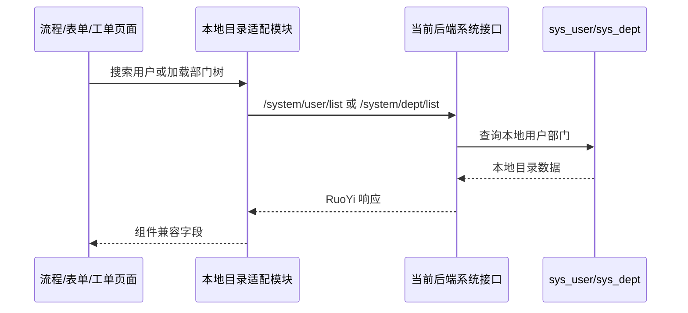
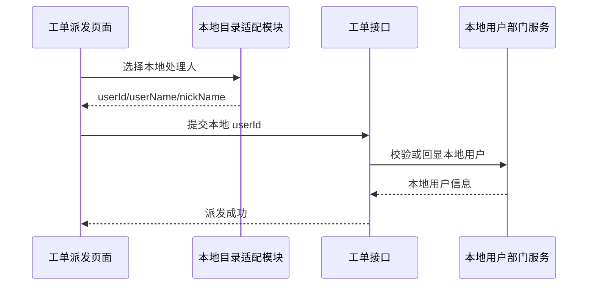

# 流程表单工单本地用户部门目录设计

## 背景

前序设计已经确认 `apaas-workflowforms-clean\apaas-workflowforms` 是当前联调的目标后端，用户体系切回 RuoYi 本地用户、角色、部门、菜单、岗位体系，并按单租户运行。

当前仍存在一个后续问题：流程、表单、工单相关页面和后端逻辑中，部分用户、部门、人员选择、名称回显仍沿用旧外部 SSO / 外部 APaaS 用户部门视图。这样会导致系统管理虽然已经切到本地 RBAC，但业务链路仍可能在选人、派发、流程节点配置、表单人员部门控件、工单基础信息生成等环节请求旧 SSO。

本设计用于收敛这一部分依赖：流程、表单、工单的用户与部门目录来源统一切换到当前后端本地 `sys_user`、`sys_dept`、`sys_role` 体系。历史外部 ID 不做兼容迁移。

## 与已有设计的关系

1. 本设计继承 `2026-07-07-vls-interfaces-into-workflows-single-backend-design.md` 的单后端目标。

   注释：后端主工程仍是 `D:\work\ide\WorkSpace\VLStream-Cloud\VLStream-Cloud-Backend-Server\apaas-workflowforms-clean\apaas-workflowforms`，不是旧的 `apaas-workflowforms`。

2. 本设计补充 `2026-07-09-ruoyi-local-user-system-single-tenant-design.md`。

   注释：前一份设计解决系统管理和 RBAC 主体系；本设计解决流程、表单、工单业务链路里残留的外部用户部门目录依赖。

3. 本设计不替代 VLS 接口整体迁移计划。

   注释：设备、算法、视频、标注等 VLS 领域接口迁移仍按原单后端设计执行；本设计只处理用户、部门、角色目录依赖。

## 已确认决策

1. 前端采用新增本地目录适配模块的方式。

   注释：新增一个面向流程、表单、工单组件的本地目录 API 模块，组件不再直接 import `@/api/unifiedUsert/sso` 获取用户和部门。

2. 迁移范围优先覆盖核心业务链路。

   注释：本轮覆盖选人、选部门、用户名称回显、部门名称回显、流程节点人员配置、表单人员部门控件、工单派发等关键能力。最近联系人、常用联系人、标签、地址本等外部 SSO 个性化能力先隐藏或降级为空。

3. 后端同步切换本地目录。

   注释：工单、流程、表单链路中仍直接请求外部 SSO 的代码，改为查询本地 RuoYi system service 或本地表。

4. 只认本地 ID。

   注释：新建和后续流转只使用本地 `sys_user.user_id`、`sys_dept.dept_id`、`sys_role.role_id`。旧外部 SSO ID 或外部部门 ID 不做映射兼容，查不到时允许空值、原值兜底或业务提示。

5. 单租户运行。

   注释：不恢复外部租户体系，不在本轮新增多租户目录能力。需要租户字段时固定为当前系统单租户值。

6. 不自行重写一套用户体系。

   注释：用户、角色、部门、岗位、菜单能力以当前 clean 后端已有 RuoYi 本地体系为准；只有确认接口缺失且无法通过现有能力补齐时，才考虑从 upstream `ruoyi-flowable-plus` 差异移植。

## 目标

1. 流程、表单、工单相关前端页面不再通过旧 SSO API 获取用户和部门。
2. 前端人员/部门选择组件可以从当前后端本地用户部门表加载数据。
3. 用户 ID、部门 ID、角色 ID 在新业务数据中统一为本地 RuoYi ID。
4. 后端工单、流程、表单业务逻辑不再直接请求外部 SSO 用户部门接口。
5. 真实前后端联调中，核心选人、选部门、名称回显、工单派发链路可用。
6. 自动化冒烟测试和内置浏览器测试可以证明系统管理、主动安全、流程/表单/工单关键页面没有旧 SSO 用户部门调用和关键报错。

## 非目标

1. 不兼容历史外部 SSO 用户 ID、部门 ID。
2. 不补完整本地通讯录、标签、常用联系人、最近联系人业务。
3. 不恢复外部 SSO 登录、外部 SSO 用户同步或外部部门同步。
4. 不整包覆盖当前 clean 后端的 `ruoyi-admin` 或 `ruoyi-system`。
5. 不在本轮完成全量人工回归；验收以核心业务冒烟和关键页面联调为准。

## 前端设计

### 本地目录适配模块

在 `D:\work\ide\WorkSpace\VLStream-Web\VLStream-ui` 中新增本地目录模块，例如：

`src/api/system/directory.ts`

该模块负责调用当前后端已有系统接口，并转换为流程、表单、工单组件需要的目录数据结构。

推荐封装能力：

1. `getUserList`
2. `getDeptList`
3. `getDeptUser`
4. `deptUserList`
5. `resolveUserNames`
6. `resolveDeptNames`

注释：函数名可以兼容现有组件的语义，但文件路径不再使用 `unifiedUsert/sso`，以避免后续误认为仍依赖外部 SSO。

### 数据来源

用户列表优先调用当前后端本地用户接口，例如 `/system/user/list` 或已确认可用的本地系统管理兼容接口。部门列表优先调用 `/system/dept/list` 或部门树接口。

适配层需要把 RuoYi 字段转换成组件友好字段：

1. 用户：`userId`、`id`、`name`、`nickName`、`userName`、`deptId`、`deptName`、`email`、`phonenumber`、`avatar`。
2. 部门：`deptId`、`id`、`parentId`、`name`、`deptName`、`label`、`children`。
3. 角色：仅在流程节点需要角色候选时，使用本地 `roleId`、`roleName`、`roleKey`。

注释：适配层集中处理字段兼容，避免每个业务组件散落一份转换逻辑。

### 组件迁移范围

需要从旧 SSO 目录 API 迁出的核心组件包括：

1. 表单设计器中的人员/部门选择控件。
2. 流程节点配置中的选人、选部门、候选人配置面板。
3. 工单派发、转派、处理人选择相关页面。
4. 用户 ID 转名称组件。
5. 部门 ID 转名称组件。
6. 人员树、部门树等被上述页面引用的基础组件。

注释：如果某个组件同时引用最近联系人、标签、地址本，本轮只保留用户部门搜索和树选择，外部 SSO 附属数据返回空集合或隐藏入口。

### 旧 SSO 前端 API 处理

`src/api/unifiedUsert/sso.ts` 不作为流程、表单、工单目录数据入口继续使用。核心业务组件完成迁移后，该文件中与用户、部门目录相关的函数不应再被核心链路引用。

注释：`refreshToken` 等认证兼容函数如果仍被基础请求层使用，可暂时保留，后续作为独立认证清理项处理。

## 后端设计

### 外部 SSO 查询清理

在目标后端中排查流程、表单、工单链路内的外部 SSO 请求，特别是形如：

1. `${http.apaas-sso}/sso/v1/getUserList`
2. `${http.apaas-sso}/sso/v1/getDeptList`
3. `${http.apaas-sso}/sso/v1/getDeptUser`
4. `${http.apaas-sso}/sso/v1/deptUserList`

这些调用需要改为本地 system service 查询。

注释：例如工单基础信息或 PDF 生成中用外部 `getDeptUser` 查询项目/部门名称的逻辑，应改为按本地 `dept_id` 查询 `SysDept`。

### 本地目录服务使用规则

后端业务逻辑应通过已有 RuoYi service 获取目录数据：

1. 用户查询使用本地 `ISysUserService` 或现有用户 mapper。
2. 部门查询使用本地 `ISysDeptService` 或现有部门 mapper。
3. 角色查询使用本地 `ISysRoleService` 或现有角色 mapper。
4. 流程候选人、候选组、部门负责人等逻辑只解析本地 ID。

注释：业务模块不直接访问外部 SSO HTTP 客户端，也不新增新的外部 SSO fallback。

### 旧 ID 处理

如果历史工单、流程实例或表单数据中保存的是外部用户 ID、外部部门 ID，本轮不做迁移。后端查询本地目录失败时：

1. 列表和详情可返回空名称或原始 ID。
2. 导出或 PDF 可使用空字符串、原始 ID 或固定占位。
3. 新建和后续流转必须保存本地 ID。

注释：这是为了避免双 ID 长期兼容，保持系统最终只依赖本地 RBAC。

## 数据流

### 前端选人

### 工单派发

## 错误处理

1. 本地用户或部门接口失败时，页面应展示空数据或现有错误提示，不回退请求外部 SSO。
2. ID 无法回显名称时，优先显示原始 ID 或空值，不能阻断页面打开。
3. 工单派发、流程节点配置提交时，如果本地用户不存在，应按后端现有参数校验返回明确错误。
4. 可选通讯录能力降级时，应避免控制台异常和接口 404。

## 测试与验收

测试产物放在：

`D:\work\ide\WorkSpace\VLStream-Cloud\VLStream-Cloud-Backend-Server\vls-server\codex`

验收范围：

1. 后端编译通过。编译前读取目标后端根 `pom.xml` 的 `<java.version>`，并按 Java 8 或 Java 17 选择 JDK。
2. 前端构建通过。
3. 后端 API 冒烟验证本地用户、部门、角色接口可用。
4. 前端自动化或内置浏览器验证核心页面可打开且无关键控制台错误。
5. 流程/表单/工单核心目录链路验证：
   - 人员搜索或列表加载可用。
   - 部门树或部门列表加载可用。
   - 用户 ID 转名称可用。
   - 部门 ID 转名称可用。
   - 工单派发选择本地用户并提交可用。
6. 网络请求检查确认核心链路不再请求旧外部 SSO 用户部门接口。

## 实施边界

本设计进入实施计划后，应先用测试或冒烟脚本确认当前旧 SSO 依赖仍存在，再进行生产代码修改。每个修改点完成后，用对应测试证明从失败转为通过。

注释：这能避免只做静态替换但没有真实联调验证的情况。
