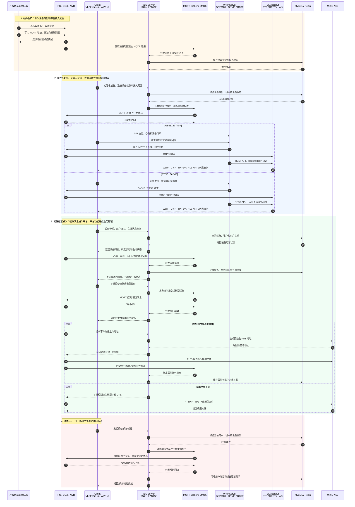

# VLStream 核心业务时序图

> 本图按“硬件生命周期 + 平台交互”展开，参与者分为硬件、平台 Server 和客户端 Client 三类。
>
> 视频主链路为 WVP 对接 ZLMediaKit，VLS 负责设备运营、事件、模型和平台业务。

## Server 依赖清单

> 统计口径：以当前项目的 `deploy/release/compose.yaml`、后端 Compose 配置以及 WVP 配置为准。版本号优先采用已经写入镜像或项目配置的版本；“未固定”表示代码依赖该服务能力，但当前仓库没有锁定具体部署版本。

### 核心业务链路

| 名称 | 用途 | 版本号 | 授权协议 |
| --- | --- | --- | --- |
| VLStream Server（VLS） | 当前项目业务后端：设备注册、用户绑定、设备运营、事件处理、模型任务和平台 API | 源码 Maven `1.1.3`；Spring Boot `2.7.11`；Java `8`；发布镜像默认 `1.1.3` | [MIT](../LICENSE)（项目自有代码；第三方依赖另行遵循其协议） |
| WVP Server | 独立视频业务后端：GB28181/SIP、ONVIF、RTSP、设备目录、实时预览、回放、云台控制，并负责协调 ZLMediaKit | 项目 `3.8.9`；Spring Boot `2.7.18`；Java `8` | [MIT](https://gitee.com/xiaochemgzi/RuoYi-Wvp/blob/master/LICENSE)（项目自有代码；第三方依赖另行遵循其协议） |
| ZLMediaKit | WVP 依赖的流媒体服务器：RTP 收流、媒体流管理、REST/Hook、WebRTC/HTTP-FLV/HLS/RTSP 等播放输出 | WVP 配置中未固定；部署时应显式锁定镜像或源码 Tag | [MIT](https://docs.zlmediakit.com/zh/more/license.html)（自有代码；第三方依赖另行遵循其协议） |
| MQTT Broker / EMQX | 硬件与 VLS 之间的消息通道：连接、心跳、事件上报、控制下发、模型任务和执行回执 | `5.4`（现有后端 Compose 固定；发布 Compose 作为外部服务接入） | [Apache-2.0](https://github.com/emqx/emqx-docker/blob/main/LICENSE)（EMQX `5.9.0+` 已变更为 BSL，不适用于当前 `5.4`） |
| MySQL | 业务主数据库：设备、租户、用户绑定、事件、任务、系统配置和审计数据 | `8.4.10-oraclelinux9`（当前发布 Compose；旧脚本为 `8.0.31`） | [GPLv2 或 Oracle 商业许可](https://dev.mysql.com/doc/refman/8.4/en/what-is-mysql.html) |
| Redis | 缓存、登录会话、在线状态、临时数据及 WVP 的运行态缓存 | `7.4.9-alpine`（当前发布 Compose；旧脚本为 `6.2.7`） | [RSALv2 或 SSPLv1](https://redis.io/legal/licenses/) |
| MinIO / S3 Object Storage | 事件图片/媒体、模型文件及其他对象的上传、下载和预签名地址 | `RELEASE.2025-09-07T16-13-09Z`（当前发布 Compose；旧脚本为 `RELEASE.2023-03-24T21-41-23Z`） | [AGPLv3 或商业许可](https://min.io/compliance) |

### 部署支撑和按场景启用

| 名称 | 用途 | 版本号 | 授权协议 |
| --- | --- | --- | --- |
| 前端静态文件/网关 Server（通常为 Nginx） | 托管 VLStream 前端静态资源，反向代理后端 API、WebSocket 及 WebRTC 路径 | 当前发布前端镜像为 `vlstream-frontend:1.1.3`，内部 Web Server 版本未在仓库公开；旧 Compose 固定 `nginx:1.22.1` | [2-clause BSD-like](https://nginx.org/en/docs/faq/license_copyright.html) |
| WebRTC Streamer | VLS 直连 RTSP 到 WebRTC 的可选播放链路；不是 WVP 的核心流媒体服务器 | `v0.8.16`（当前发布 Compose） | [Unlicense](https://github.com/mpromonet/webrtc-streamer/blob/v0.8.16/UNLICENSE)；其内含 WebRTC、civetweb、live555 等依赖还需分别遵循对应协议 |
| FFmpeg | WVP/ZLMediaKit 的按需拉流、转码、截图或格式转换辅助程序；不是独立的媒体平台 | 未固定，由部署环境提供 | [LGPLv2.1+；启用 GPL 部件时为 GPLv2+](https://ffmpeg.org/legal.html) |
| 外部 AI/训练推理服务 | 算法训练、模型转换、推理或模型产物生成；当前时序图只画了模型任务下发和对象存储，不把该服务作为核心视频链路 | 未在本仓库固定 | 外部服务协议，待具体部署确认 |

### 依赖结论

- **核心运行依赖为 7 类**：VLS、WVP、ZLMediaKit、MQTT/EMQX、MySQL、Redis、MinIO。
- **前端部署**通常还需要 Nginx 或等价的静态文件/网关 Server。
- **当前发布 Compose 还显式包含 WebRTC Streamer**，但它只服务 VLS 的直连 WebRTC 播放场景；如果统一走 ZLMediaKit 的 WebRTC 输出，可将它作为可选项。
- **WVP 的核心媒体服务器就是 ZLMediaKit**。当前 WVP 代码中存在 FFmpeg 拉流接口，但没有发现另一套必须独立部署的通用流媒体服务器。
- **版本统一建议**：正式部署前补齐 ZLMediaKit、FFmpeg、EMQX 和前端容器内部 Web Server 的明确 Tag，并将 WVP 与 VLS 的镜像版本写入同一份发布清单。

## 参与者职责

- 硬件：IPC、BOX、NVR，负责设备身份、协议接入、心跳、事件、控制执行和模型回执。
- VLS Server：负责设备注册、用户绑定、设备运营、事件业务、模型任务和平台数据管理。
- MQTT Broker：负责硬件与 VLS 之间的消息传递，不承载设备管理业务规则。
- WVP Server：负责 GB28181、ONVIF、RTSP 等视频设备接入、点播、回放和视频控制。
- ZLMediaKit：负责 RTP 接收、媒体流管理和 WebRTC/HTTP-FLV/HLS/RTSP 等播放输出。
- Client：VLStream 前端承载平台运营功能，WVP 前端承载视频预览、回放、云台和通道管理。
